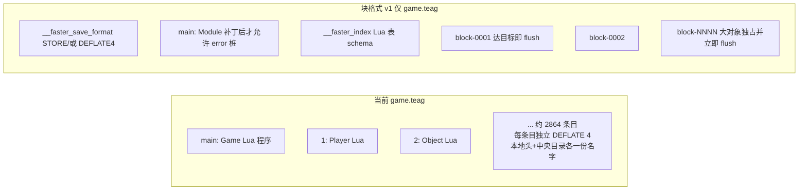
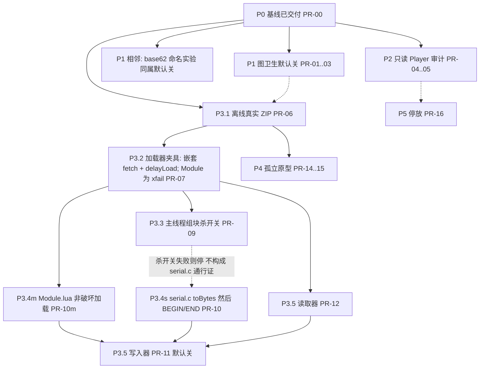

# ToME4 / T-Engine4 存档架构调整方案

| 字段 | 值 |
| --- | --- |
| 标题 | ToME4 / T-Engine4 存档架构调整方案（增量，非重写） |
| 作者 | Grok 4.6 |
| 日期 | 2026-09-14 |
| 状态 | Draft |
| 游戏 | ToME 1.7.6 |
| 引擎提交 | `624a67329fe2ad440c5b344785a9c73fcf22ae63` |
| Addon | Faster ToME4 0.2.11（生产默认行为等同 0.2.10 短十进制编号；0.2.11 三项实验默认关闭） |
| 工作区 | `/workspace/t-engine4` |

本文把已经达成共识的诊断落实为可执行的增量调整计划：分轨（addon 先行 / 引擎后置）、格式版本与**非破坏**失败封闭、分阶段门禁、兼容规则和 PR 序列。**不是**绿场重写。块 writer 在没有读取器、没有 `Module.lua` 非破坏加载路径时不得合并。

证据纪律与主分析文档一致，后文凡给出数字或机制处均标注：

- **代码事实**：固定提交源码当前做什么。
- **测得结果**：指定输入、版本、测量边界下的结果；不得跨数据集拼接。
- **设计推断**：改动为何可能有效、必须承担的代价。
- **未验证**：缺真实保存 / 读档 / 回放 / 故障 / 跨平台证据，不得计入已交付收益。

数据集不得混用：

| 数据集 | 用途 | 关键边界 |
| --- | --- | --- |
| 保留的 Faster 0.2.8 角色目录 | 文件组成、Map 字段、短编号离线转换、分块代理 | 25 文件，21,908,270 bytes；主档 2,859 条目；不含相邻 `world.teaw` |
| 原始角色目录 | Player 夹带、`in_inven` 结构 | 22,208,501 bytes；主档 2,849 条目 |
| Faster 0.2.10 正式包 | 短编号游戏内 A/B | 20 对、40 次保存；每个主档 2,864 条目 |
| Faster 0.2.11 正式包 | 三项实验 CPU 门槛 | 三组各 30 对、共 180 次保存；实验默认关闭 |

统一十进制 MB（1 MB = 1e6 bytes）；KiB/MiB 按 1024。所有后续体积 / 时间声明的对照基线是 **0.2.10 短十进制编号已开启**，不是原版长名称。

---

## Overview

2009 年以来 T-Engine4 把一场游戏存成若干 ZIP（`world.teaw` / `game.teag` / `zone-*.teaz` / `level-*.teal`），每个类实例一个 DEFLATE 条目，正文是可 `require` 的 Lua 程序，身份靠 `loadObject` 与正文里的 `__CLASSNAME`。这个合同在当前规模下仍然自洽，但三个**单位**已经错了：压缩与随机访问单位仍是单个类实例；身份只存在于一次 `Savefile` 内部；快照合同（`cloneForSave` 复制活图）不等于持久化合同（C `toZip` 过滤 + `onSaving`/`save` 副作用）。

调整后的系统保持上述合同不变，只替换三个单位：

1. **压缩单位**改为按对象边界聚合的索引块（优先比较 64 KiB 与 256 KiB 目标块）。v1 只用于 `game.teag`。`main` 仍是逻辑根；物理 ZIP 另存格式标记与索引。切片发生在 FasterSave `loadReal` 的 `fetch` 里（short-circuit 与外层 `pcall` **都**走切片），再交给原 `class.load`。
2. **身份 / 生命周期**只在事件发生时做已识别的图卫生（标准库存 `in_inven.id` 表→数字；Fearscape 仅在原版成功返回后来源层后清 trapper）。不做保存期全图扫描，不做旧档 `loaded()` 迁移，不按类名从历史 `.teaz` 删除 Player。跨档实体键只允许在只读反向引用审计给出可独占集合之后作为后续选项。
3. **快照**仍是完整 `cloneForSave`。按消费者合同裁剪快照是 CPU/内存课题，不是体积策略，不是第一批 PR。

约束是硬的：缩小存档且**不增加保存时间**（同步 wall+主 CPU、完整 wall、最长不可切片主线程、后台 CPU、峰值内存同时观察；P3 的可操作门禁见 Key Decision 15）；原版 1.7.6 读取器必须继续加载旧长名称和 0.2.10 短十进制名称；新格式失败封闭且**非破坏**：原版 `Module:instanciate` 不得删除角色目录、不得用空 `W.new()` 覆盖共享 `world.teaw`、不得把残缺 Game 当成功（见 Key Decision 11–12）；不改游戏语义；能用 Faster overload/superload/hooks 完成的事先走 addon；`src/serial.c` 与 `Module.lua` 加载失败合同只作为**具名后置轨道**；v1 块 writer 只写 `game.teag`；不强制重写全部历史区域；Steam / Windows / 其他角色未测，不得外推 Linux Xvfb 数字。

---

## Background & Motivation

### 仍合理的合同（不重开）

**代码事实。** 引擎把存档定义为“直接对象图序列化”（`engine/Savefile.lua` 文件头注释；`Savefile.saveObject:142` LIFO 队列；`class.save:443` 调 `core.serial.new(...):toZip(self)`；受限环境在 `class.lua` `deserialize:484–497`，`load:501` 包装它）。类实例身份是 `loadObject('键')`，类名在正文 `__CLASSNAME`，不在 ZIP 文件名。文件按持久化寿命拆分：`Savefile.nameSaveGame:243` → `game.teag`；`nameSaveZone:337` → `zone-%s.teaz`；`nameSaveLevel:374` → `level-%s-%d.teal`；`World.saveWorld:36` 于 `:38` 调用 `savefile_pipe:push("", "world", self)` → 角色目录**同级**的共享 `world.teaw`（`Savefile.init` 空角色名）。`Zone.leave:190` 仅在 `persistent=="zone"` 时入队区域档；`Zone.leaveLevel:876` 按 `persistent` 决定内存 / 磁盘 / 丢弃。普通保存因此**不会**重写全部历史区域。Lua 状态不可被压缩线程读取，所以 `SavefilePipe.push:125` 必须先同步 `cloneForSave`（`class.lua:362`，`noclonecall=true`, `use_saveinstead=true`）。可执行 Lua 正文让 addon / 新类经 `require(obj.__CLASSNAME)` 恢复方法。

**测得结果。** 0.2.10 `compact_save_names` 默认开启：正式 20 对中，主档中位数 2,667,071 → 2,480,462.5 bytes（**−7.00%**），完成总 wall 510.80 → 498.49 ms（**−2.41%**）；原版读取器可重载短编号档。实现见 `overload/engine/FasterSaveNames.lua`：保存器内弱缓存分配十进制键，根仍为 `main`。

### 三个已经错误的单位

**1. 压缩 / 随机访问单位 = 一个类实例。**

**测得结果（0.2.8 保留目录）。** 22 个 ZIP、21,068 条目；未压缩正文 52,508,940 bytes，压缩正文 18,718,145 bytes，容器开销 2,693,544 bytes（约目录的 12%）。热路径是 `loadReal("main")` 拉起整个可达图（`Savefile.lua:465`，`loadGame:567`），按条目随机访问的税基本没人付。离线块代理（先可逆短编号、保持原条目顺序、按对象边界组块、DEFLATE 4）把主档压缩正文 2,239,481 → 838,504 bytes（256 KiB 目标块），压缩 CPU 中位数 59.31 → 23.29 ms（约 −61%）。把 DEFLATE 4→9 是错误杠杆：主档压缩正文 2,296,903 → 2,227,106 bytes，CPU 61.88 → 114.51 ms。

**2. 身份只存在于一次 Savefile 的类实例。**

**代码事实。** `Savefile.tables` / `getFileName` 的键只在本次序列化有效；跨 archive 没有全局对象表。区域档从 Zone 根独立遍历。`Game.leaveLevel:844–881` 通常从楼层移除 Player / 队员实体，但其它引用仍可把 Player 及其背包、任务拉进 `.teaz`。普通表没有身份，但 `ActorInventory.onAddObject:317` 把 `in_inven.id` 写成调用方传入的 `inven_id`——当调用方传入库存表时，C 编码器按普通表内联，再次写出其中的物品引用。Fearscape 的 `demon_plane_trapper`（`shadowflame.lua:243`）在原版 `deactivate:286–368` 成功退出后仍不清（FasterFearscape 钉住 `lastlinedefined == 368`）；`sand.lua:53–91` 为每个不稳定沙道实例设置 `act` / `dig` / `tooltip` 闭包。

**测得结果。** 原始目录 21 个区域中 **15 个含 Player、合计 20 条目**（主档另 1 条）。`in_inven`：2,955 个物品有归属字段；id 为 table 1,037、number 1,791、string 127。这些是结构计数，不是可安全删除的压缩独占字节。

**3. 快照合同 ≠ 持久化合同。**

**代码事实 / 测得结果。** `cloneForSave` 复制完整活图（0.2.2 真实图差分约 127,833 张表、509,503 个键值、27,373 个计数对象），过滤发生在 C `serial_tozip:477–490`。`onSaving` / `save` 会改快照（`Level.onSaving:46` 清 `last_iteration`；`Game.save:744` 更新游玩时间）。Yield 在 `saveObject` 每对象一次（`Savefile.lua:156`），单个大表的 `toZip` 没有内部切片。只有 DEFLATE 在 SDL worker 线程（`serial.c:156`，level 硬编码 4）。

### 0.2.11 必须被设计消化的课

**测得结果。** `compact_inventory`、`fearscape_cleanup`、`compact_save_names_base62` 均已实现，**全部默认关闭**（`init.lua` `addon_version = {0,2,11}`；`superload/mod/class/Game.lua:6–14` 要求显式 `true` 才 `require` 安装器）。普通保存的全进程 `ru_utime` 门槛（30 对，`log(candidate/baseline)` 的 Student t 单侧 95% 上界必须 `< log(1.01)`）未通过：

| 组 | 几何均值变化 | 单侧 95% 上界 | 判定 |
| --- | ---: | ---: | --- |
| base62 + 两项事件，普通保存 | +1.308% | +2.645% | 未证明 |
| 十进制 + 两项事件，普通保存 | +0.631% | +1.550% | 未证明 |
| 十进制 + 两项事件，先加 24 件物品再保存 | −0.974% | +0.086% | **该场景**通过 |

库存“先加入再保存”场景主档中位数少 24,926 bytes（0.990%），条目数不变。无新事件的普通保存未压缩字节完全相同，几字节压缩差不计收益。Fearscape 活场景主档 2,337,677 → 2,335,939 bytes（−1,738 bytes、1 个 NPC 条目），**不是**整张 Fearscape 地图被释放的证明。

教训（设计推断，作为后续门禁）：图卫生的正确地点是事件发生时；但普通保存 CPU 被编码 / 压缩固定成本主导，小图收益会淹没在噪声里，甚至在全进程指标上表现为回退。因此：**禁止保存期全图扫描；禁止 `loaded()` 迁移旧的脱离 `in_inven` 表；禁止在没有现场证明时删除旧 Fearscape；禁止用库存场景的通过去放行普通保存默认开启。**

### 角色目录成本位置（0.2.8 保留样本，测得结果）

| 内容 | bytes | 比例 |
| --- | ---: | ---: |
| 21 个历史区域档 | 18,749,144 | 85.6% |
| `game.teag` | 2,662,545 | 12.2% |
| `cur.png` | 432,645 | 2.0% |
| 日志与描述 | 63,936 | 0.3% |
| 合计 | 21,908,270 | 100% |

普通保存立刻改写的是主档。短编号在只重存主档时约等于该目录 **0.85%** 的即时减少；区域档要到自然重存才吃到剩余收益。为立刻兑现全目录收益而遍历重存所有区域，本身增加工作，违反时间约束。

---

## Goals & Non-Goals

### Goals

1. 缩小存档磁盘占用，且不增加保存时间。保存时间必须同时观察：
   - `Game.saveGame` 同步返回前的 wall 与主线程 CPU；
   - 发起到 worker 完成、`checkValidity`、`on_end` 的总 wall；
   - 主线程最长不可让出片段；
   - 后台 CPU 与峰值内存（Lua `collectgarbage("count")` 不能代替 C 堆）。
2. 原版 ToME 1.7.6 读取器继续加载：**旧长名称**与 **0.2.10 短十进制名称**。可选 base62 仍是原读取器可执行的字符串键（`FasterSaveNames.lua` 字母表，`main` 碰撞逃逸为 `_main`）。
3. 新容器格式失败封闭且**非破坏**：显式读取器选择 / 版本；禁止因缺 ZIP 条目而让 `loadReal` 返回 `nil`、再被 `class.load` 写成残缺对象；**同时禁止**原版 `loadGame()` 返回 nil 后走到 `Module.lua:1108–1109` 的 `save:delete()`（会删光角色目录，含仍可读的历史 `.teaz`）。在 `Module.lua:1106–1116` 的调用方被规定并经夹具证明之前，**不得**把 `error()` 写进 ZIP `main` 当作已交付的失败封闭。
4. 不改变游戏语义：库存 / 装备 / 转化、Fearscape 死亡包装、区域重访、AI 追踪、uniques、`__savefile_version_tokens`、party、quests、堆叠实例身份。
5. 能用 Faster overload / superload / hooks 完成的事先走 addon。`src/serial.c` / 引擎 `Savefile.lua` 只出现在后置、显式门禁的轨道。
6. 保持生产 GC、FBO guard、500 ms `hit_warning` 默认；不为体积改这些。
7. 历史区域与 `world.teaw` 在 v1 保持原容器；不做后台重压缩、不做全目录强制迁移。仅 `game.teag` 在 writer 门禁通过后随普通保存自然改写。

### Non-Goals（明确禁止当作本方案的体积手段）

这些看起来像架构缺陷，但已裁定**不是**，不得删除或“顺便修”：

- 历史 `.teaz` 体积本身（回访语义；只能随自然重存受益）。
- `distance_map` / `ai_actors_seen`（历史 AI 状态，不是 FOV 缓存）。**代码事实：** `ActorFOV.lua:106` 写入 `game.turn + radius - sqrt(sqdist)`；`distanceMap:214` 暴露给追踪；`engine/ai/simple.lua` 与 `mod/class/interface/ActorAI.lua:819` 读取；`ActorAI.autoLoadedAI:68,73–74` 建立弱键 `ai_actors_seen`，`:143–145` 在 `doAI` 里填充；`NPC.lua:201` 用它限制连续仇恨传播。
- 把堆叠物品收成 `count`（`Object.stack:141` 保存真实实例；外部引用与差异存在）。
- Map `lites/seens/remembers` 的原文大小当作可删量（已压缩得好；破坏性删除代理不是可交付编码）。
- 提高 DEFLATE 等级；空闲重压缩；合并完整 GC；提前唤醒现 worker。
- 截图 / 日志（约目录 2.3%）作为本轮结构优化。
- 按类名从区域档剥离 Player；全局 `_no_save_fields` 清洗 FOV/AI/粒子。
- 用块代理的压缩正文表宣称“目录缩小 60%”。
- 把 0.2.11 库存场景的 24,926 bytes 中位收益当成默认开启功能。

---

## Key Decisions

1. **保留 2009 对象图合同，只改三个单位。** 重写为二进制对象流 / 跨档对象库会同时丢掉 addon `require` 路径、原读取器、以及现有测试夹具。增量调整压缩单位、事件期身份卫生、（可选后置）快照范围即可覆盖当前证据里最大的结构浪费。

2. **压缩单位：按对象边界的索引块，不是“整个 archive 一块”、也不是中途切开对象。** 离线代理显示 64 KiB 与 256 KiB 已接近整档一块的压缩正文，且 256 KiB 仍保留一定随机性。v1 超大对象自成一块（0.2.8 全目录最大对象 1,362,489 bytes，**测得结果**）；分片协议是后续研究。

3. **双轨：Faster addon 现在做能做的；`serial.c` 是具名后置轨道，不是 PR1。** 当前公开 C API 只有 `core.serial.new` / `threadSave` / `popSaveReturn` / userdata `toZip`（`serial.c:520–525`）。没有“把正文返回 Lua”，没有 BEGIN/ENTRY/END/ABORT。用 `fs.zipOpen` / `zip:add`（`physfs.c:207,235`）可写 ZIP，但压缩在调用线程——主线程压缩不得标榜“保存时间不变”。

4. **0.2.10 短十进制编号保持默认开，作为一切后续声明的基线。** 0.2.11 三项实验保持默认关，直到各自在**普通保存**场景独立通过已发布的全进程 user CPU 门槛。库存“先加入再保存”通过不能放行默认开。

5. **图卫生只发生在事件点，且已实现代码保持窄契约。** `FasterInventory.compact` 仅在原 `onAddObject` 链全部完成后、`self.inven[inven.id]==inven`、标准 `{actor,id}` 记录、无扩展字段时把表 id 写成数字。`FasterFearscape` 仅在原退出 tick-end 回调正常返回、施法者/目标/回调/楼层身份仍匹配、目标存活并放回来源层后清除 `demon_plane_trapper`。不扫描、不 `loaded()` 迁移、不拆地图。

6. **新格式失败封闭 = 不残缺且不删档，禁止为兼容而双写旧逐对象条目。** 原版 `loadReal` 在条目缺失时返回 `nil` 且不抛错（`Savefile.lua:467–468`），`class.load` 会把 `d["player"]=nil` 写成“成功”的残缺图——这条必须继续避开。但 `error()` 进 ZIP `main` **不是**安全的失败封闭：`loadReal:478–485` 吞掉错误并返回 nil，`loadGame:567` 返回 `nil, delay_fct`，`Module.lua:1106–1116` 在 `not g` 时调用 `save:delete()`（`Savefile.lua:94–98` 删除角色目录每一个文件，含历史 `.teaz`），且 `delay()` 只在 `g` 为真时运行，警告弹窗根本不会出现。随后仍对 `:1086` 的空 `M.new()` 做 `prerun`/`run`。因此：在引擎加载失败合同改完并由含 `Module.lua:1106–1116` 的夹具证明角色目录 SHA256 不变之前，生产 writer 不得写出块格式，也不得把 `error()` 桩当作已完成的兼容策略。双写仍禁止。

7. **格式版本放在 ZIP 额外条目，不复用 `__saved_saveversion`。** **代码事实：** `__saved_saveversion` 是 `Game.saveVersion("new")` 生成的 UUID 令牌（`mod/Game.lua:2801`），`SavefilePipe.doLoad:300` 用来拒绝主档不认识的区域令牌。它不是编解码器版本。

8. **迁移 = 自然重写，且 v1 只自然重写 `game.teag`。** 下次普通保存可把主档写成块格式（在 writer 门禁通过之后）。`.teaz` / `.teal` / `world.teaw` 在 v1 **保持原容器**（见 Key Decision 12），即使它们被自然入队。v1 不做 idle recompress，不做全目录 walker。

9. **生产 writer 必须保留后台压缩，或用完整保存 A/B 证明主线程压缩没有回退——后者以当前证据几乎必然失败，故默认不走。** 块代理省下的约 36 ms 主档压缩 CPU（59.31−23.29，**测得结果**）是**局部压缩微基准头寸**，不是可以随便花在 Lua 组块、索引和 `table.concat` 上的预算。

10. **Steam / Windows / 其他角色 / 硬件 GPU 标为验证缺口，不假设 Linux Xvfb 数字成立。**

11. **失败封闭的调用方是 `Module:instanciate`，不是 `loadReal` 弹窗文案。** 保守默认（可被 Q6 覆盖）：引擎必须先打补丁，使 `loadGame()` 失败时 (i) 不 `save:delete()`，(ii) 不对空 `M.new()` 做 `prerun`/`run`，(iii) 回到 boot 菜单。Boot 菜单隐藏 Play 按钮**不够**：`game/engines/default/modules/boot/dialogs/LoadGame.lua:48–54` 仅当 `usable` 时显示 Play，但同项二次点击（`:48`）仍调 `playSave`，而 `playSave:178–205` **从不检查** `usable`；`Module:loadAddons` 的 `saveuse`（`:552–569`）只过滤已安装 addon，缺 Faster 不是硬失败。独立 boot companion 是纵深防御，不是充分条件。夹具必须跑真实 `Module:instanciate` 路径并断言角色目录 SHA256 不变。在该补丁进入玩家实际运行的引擎二进制之前，**禁止合并会写出块格式的 writer**（即使 flag 默认关）。`error()` 桩只允许出现在该补丁之后。

12. **v1 块 writer 只写 `game.teag`。** `world.teaw` 保持原逐对象布局，直到有单独的世界档兼容故事。**代码事实：** `Game.saveGame:2860–2861` 每次都在游戏档之后保存 World；`loadWorld:511` 失败时 `Module.lua:1091–1098` 执行 `_G.world = W.new()`——空世界，不是拒绝加载。若把共享 `world.teaw` 写成块格式，一次原版读档可以在删掉角色 A 的同时，随后把空白世界写回，毁掉角色 B 的世界状态。`.teae` 同样排除。`.teaz` / `.teal` 在 v1 也保持原布局（自然重存仍写旧容器）；区域加载失败虽不走 `save:delete()`，但仍会丢掉回访状态，不值得在失败封闭未证明前扩大写入面。

13. **块读取器必须替换 FasterSave `loadReal` 里对 captured `load` 的两处调用，禁止只改外层 `pcall`。** **代码事实：** `FasterSave.lua:65–71` 在 `active[self]` 已设置（或 `delayLoad` 异常）时直接 `return load(self, name)`，而外层才 `pcall(load, self, name)`；两处的 `load` 都是安装时捕获的原 `Savefile.loadReal`（`fs.open(self.load_dir..key)`，缺条目返回 nil，`:467–468`）。`class.load` 的 `loadObject`（`class.lua:490–495`）对每个非 self 键调用 `current_save:loadReal(n)`。只在外层 `pcall` 里 `class.load(_fasterSlice("main"))` 时，子对象的嵌套 `loadReal` 走 short-circuit，按 ZIP **文件名**打开 `"1"` / `"2"`；块档的 namelist 只有 `{main,__faster_save_format,__faster_index,block-*}`，于是 `d["player"]=nil`——这是 Goal 3 要禁止的残缺图，而且发生在 **Faster 已安装的成功路径**。正确组成：一个局部 `fetch`，当 `_fasterFormat()` 已缓存为块格式时对**任意**对象键（含 `"main"` 与子键）执行 `class.load(self:_fasterSlice(n), n)`，**永不** `fs.open` 对象键；无标记则调用 captured stock `load`。delayLoad 线性化（`active[self]` 批次、头插改追加）保持今日语义。`_fasterFormat` / `_fasterSlice` 自己用真实 ZIP 名打开标记与索引，不得再进 `loadReal`。安装顺序仍是先 FasterSave（钉 465–493）再注入这两个方法。`Savefile.lua` 行号漂移必须同一 PR 更新钉。P3.2/PR-07 必须断言：namelist 仅上述四类条目的 archive 仍能恢复子对象身份（非 nil）以及 2001 个 delayLoad 次序。

14. **块写入流水：逐对象编码，达目标即 `queueBlock` 并释放正文，禁止把整档正文堆在 Lua 里等到 archive 结束。** 对象 N 编码 → 追加到当前块缓冲 → 达到 64/256 KiB 目标或该对象自身超标（0.2.8 全目录最大对象 1,362,489 bytes，**测得结果**）时，把不可变字节 `queueBlock` 出去并丢弃这些对象的 Lua/C payload。在飞队列有界（背压）。索引可在内存累积（小）并在 `endArchive` 前写出。峰值内存验收属于 P3.5：活图 + 快照 + **一个**在建块 + 有界在飞块，而不是活图 + 快照 + 全部正文。

15. **即使 `compact_save_blocks=true` 仍默认关，P3 writer 也必须有可操作的时间门禁，且不得用总 wall 掩盖同步回退。** 主 CPU 门禁：与 0.2.11 相同的普通暂停保存、30 对、进程 `ru_utime` 单侧 95% t 上界 `< log(1.01)`。同步轴：相对 P0，同步 wall 与同步主线程 CPU 不得有统计上可分辨的回退（组块发生在主线程；worker 侧 DEFLATE 微基准的 ~36 ms **不能**搬到主线程花）。体积：packed `game.teag` 必须小于 P0 短编号基线中位数 2,480,462.5 bytes。RSS / C 堆必须报告，峰值不得差于该次对照的 P0 高水位 + 在飞块预算（默认按 2 × 最大块，含 1.3 MiB 独占对象）。禁止用总 wall 改善或 0.2.10 已交付的 −2.41% 当本功能的预算。默认开另需同一套 30 对门槛；实验 flag 不得更松。

---

## Proposed Design

### 1. 目标架构（调整落地后的系统）

分层描述。上层合同不变；中层压缩与索引改变；下层发布 / 校验协议加强。

#### 1.1 不变合同

| 层 | 保持 |
| --- | --- |
| 快照 | `SavefilePipe.push` 同步 `cloneForSave`；Lua 活图不给 worker 读 |
| 身份 | 类实例 `loadObject`；同一实例同一键；不同实例不因内容相同而合并 |
| 类 | `__CLASSNAME` 在正文；`class.load` `require` 后 `loaded` |
| 正文 | 可执行 Lua：`d={}` → `setLoaded(name,d)` → 字段 → `return d`；函数仍是 `loadstring(lua_dump)` |
| 文件寿命 | `world.teaw` / `game.teag` / `zone-*.teaz` / `level-*.teal`；普通保存不重写全部历史区域。v1 块格式只用于 `game.teag`；World 仍走原 writer |
| 过滤 | 仍由 `class.save` 的 allow/disallow/`_no_save_fields` 与 C `disallow2` 覆盖语义决定写出字段 |
| 令牌 | `__saved_saveversion` / `__savefile_version_tokens` 语义不变 |
| 延迟加载 | `setLoaded` 先登记空表；`loadNoDelay` 立即 `loaded`；其余进 `delayLoad`；Faster 的队列线性化（`FasterSave.installSavefile`）继续组成，不被新读取器拆掉 |

普通表仍然**没有**通用身份。v1 不“顺便改进”普通表别名；共享普通表仍可能多次内联。这是原编码器范围（`serial.c:406–437`），不是本方案的修复对象。

#### 1.2 调整后的压缩单位

Writer（逻辑，不绑定实现语言）仍按 `saveObject` 的 LIFO 发现顺序调用 `onSaving` / `save` / 编码。编码产出的是**每个对象一份完整 Lua 正文**（与今天 `toZip` 写入 ZIP 条目的字节同构）。**v1 仅当当前 archive 是 `game.teag` 时进入块层**；World / Zone / Level / Entity 走原逐对象 `toZip`。

块层（流式，见 Key Decision 14）：

- 按该顺序在对象边界上累积，目标块 64 KiB 或 256 KiB（生产默认在真实 packed ZIP 后于 Q3 二选一；未锁定前配置项可改）。
- 单对象超过目标时**整对象独占一块**并立刻 `queueBlock`；v1 不在对象中途切开。
- 当前块达到目标：**立即** `queueBlock` 不可变字节，丢弃这些对象的 Lua/C payload，不把整档正文留到 archive 结束。
- 在飞队列有界；索引在内存累积，`endArchive` 前写出。
- 写出 `block-NNNN` ZIP 条目（DEFLATE 4，与现 worker 相同 zlib 参数：`-MAX_WBITS`, `DEF_MEM_LEVEL`, `Z_DEFAULT_STRATEGY`）。对象在块内紧密拼接，无 padding。
- 写出索引 `__faster_index`（schema 见 Format 节冻结表）。
- 写出格式标记 `__faster_save_format`。
- ZIP 条目 `main` **必须存在**（原 `checkValidity:747` 与 `loadGame:567` 都找它）。**仅在 Key Decision 11 的 Module 补丁进入玩家二进制之后**，`main` 才允许是 `error()` 桩。补丁之前生产路径不得写出该容器。真正的 Game 正文以对象键 `"main"` 存在索引里，位于某个 block 中。

`loadReal(key)`：格式检测在 PhysFS `mount` 之后、对本 `Savefile` 实例做一次并缓存（`_fasterFormat` 直接打开 ZIP 条目 `__faster_save_format`，不经 `loadReal`）。FasterSave 的 **short-circuit 与外层 `pcall` 都走同一个 `fetch`**：已缓存为块格式则 `class.load(_fasterSlice(key), key)`，对象键永不 `fs.open`；无标记则 captured stock `loadReal`。`self.loaded[key]` 命中时与今日一样直接返回（`Savefile.lua:466`），这样 `setLoaded` 先登记的空表能解开循环。`setLoaded` 仍由正文在填充前调用，`LOAD_SELF` 不变。delayLoad 批次语义不变。

#### 1.3 调整后的身份 / 生命周期

- **库存（已实现，默认关）。** 事件：原 `Inventory`/`Actor`/`Player.onAddObject` 链结束。条件：`getInven` 为固定版；`inven` 无元表；`inven.id` 为有限正整数；`self.inven[id]==inven`；`o.in_inven` 恰好 `{actor=self, id=inven}`。动作：`owner.id = id`。不改字符串 id，不改扩展字段，不改回调期间所见参数。
- **Fearscape（已实现，默认关）。** 事件：原 `T_DEMON_PLANE.deactivate` 的 tick-end 回调完整跑完。条件：安装时见过固定 `activate:177–285`；退出时施法者 / 目标死亡包装身份匹配；目标活着、两格都找到、已回来源 `source_level` / `source_zone`、sustain 已解除、死亡回调已恢复。动作：`target.demon_plane_trapper = nil`。失败退出、死亡包装仍需要、未知覆盖：保持原引用。不摧毁 map，不给 Actor 挂 addon 死亡闭包。
- **历史 Player。** P2 只读审计。禁止本阶段 `_no_save_fields` 剥离。跨档 stub 仅在审计证明某类反向引用的可达压缩字节是**独占且过期**之后，作为 P5 选项单独立项。
- **禁止**保存期全图反向索引。

#### 1.4 调整后的快照（可选后置，非体积）

保持完整 `cloneForSave`。若未来枚举了全部保存消费者（`Game.save` 白名单 ≠ 消费者集合：在线资料读 `uiset.logdisplay`、`calendar`、`__mod_info`；`Projectile.save` 读 `game.level.map` 等），可以做持久化图感知的克隆。0.2.5 审计：`tooltip` 独占约 1,039 张 raw 表（约该次 raw 图 0.81%），`uiset` 单边可达 36,899 但独占仅 694。这不是体积方案，不是 PR1。

#### 1.5 当前 vs 目标：保存管线


事件期图卫生（库存 / Fearscape）发生在上图**之前**的游戏逻辑里，不插入保存协程，也不在 `saveObject` 里扫图。

#### 1.6 当前 vs 目标：ZIP 布局



逻辑上 `loadObject('1')` 的键不变（默认仍用 0.2.10 十进制；base62 仍是实验）。物理上键不再是 ZIP 文件名，而是索引键。**不会**为兼容同时再写一份 `1`、`2`、… 旧条目。

#### 1.7 带索引的加载路径

```mermaid
sequenceDiagram
    participant Boot as boot LoadGame / 其它 instanciate
    participant Mod as Module.lua:1086-1122
    participant SF as Savefile
    participant FS as FasterSave.loadReal 包装
    participant Fmt as __faster_save_format
    participant Idx as __faster_index
    participant CL as class.load

    Boot->>Mod: instanciate(mod, name, false)
    Note over Boot: desc.lua / addons 列表不是闸门<br/>LoadGame 二次点击不检查 usable
    Mod->>Mod: game = M.new(); 可能 loadWorld
    Mod->>SF: loadGame → loadReal("main")
    SF->>FS: FasterSave loadReal: fetch 用于 short-circuit 与 pcall
    FS->>Fmt: mount 后检测一次, 缓存在 Savefile; 不经 loadReal
    alt 无标记: 长名称或 0.2.10/可选 base62
        FS->>CL: fetch → 原 fs.open(ZIP 名)
    else Faster 在场且 indexed-block v1
        FS->>Idx: fetch("main") → _fasterSlice, 永不 fs.open 对象键
        FS->>CL: class.load 切片; loadObject 子键再进 loadReal
        Note over FS: active[self] 已设时仍走 fetch<br/>子键 "1" 不是 ZIP 名, 必须切片而非 nil
    else Faster 不在场 / 未知 version
        Note over Mod: 今日: loadReal 返回 nil → save:delete() 删光角色目录<br/>目标: Module 补丁拒绝加载、不删除、回菜单
        Mod-->>Boot: 非破坏拒绝
    end
```

**今日原版路径是破坏性的，不是“弹窗文案问题”。** **代码事实：** `game/engines/default/modules/boot/dialogs/LoadGame.lua`（引擎捆绑 boot，`for_module` 不是 `tome`）在缺 addon 时把名字画成红并设 `usable=false`、隐藏 Play 按钮，但同项二次点击仍调用 `playSave`，`playSave` 不读 `usable`。`Module:loadAddons(..., saveuse)` 只从已安装列表里去掉存档未点名的 addon。`loadReal` 对 `error()` 桩返回 nil 之后，`Module.lua:1108–1109` **删除角色目录**。P3.1 若只测孤立 `class.lua`/`Savefile.lua` 夹具，会在真实 boot 仍删档时给出假通过。

**目标路径（Key Decision 11）：** 引擎 `Module.lua` 补丁使 nil Game 不删除、不 `prerun` 空实例、回到菜单。补丁之后 ZIP `main` 才允许 `error()` 桩，以避免残缺图。Faster 在场时根本不执行桩：`fetch("main")` 与所有嵌套 `fetch(子键)` 都从索引切片，ZIP namelist 不必含 `"1"`、`"2"`。加载块缓存：最多 2 个已解压块；若单块超过 512 KiB（超大对象），只缓存这一块。

#### 1.8 阶段依赖



统一编号：阶段用 **P0–P5 / P3.1–P3.5**；PR 用 **PR-00–PR-16**（另 **PR-10m** = Module 补丁）。上图 P3a–P3d 不再使用。`compact_save_names_base62` 是 P1 **相邻的命名实验**，不是图卫生。P3.3 只能**否决**主线程组块成本，不能批准写 `serial.c`。P3.5 writer **不得**在没有读取器、没有 Module 非破坏夹具（PR-10m 已反转 xfail）通过的情况下合并。完整 Phase→PR 表见 PR Plan 节首。

---

## Dual track: addon-now vs engine-later

### Addon 现在就能做（部分已原型 / 已默认关着陆）

| 工作 | 现状 | 本方案处置 |
| --- | --- | --- |
| `compact_save_names` 十进制 | 0.2.10 默认开 | **保持默认开**；后续数字相对它声明 |
| `compact_inventory` | 0.2.11 已实现，显式 `true` 才加载模块 | 保持默认关，直到普通保存 CPU 门禁独立通过 |
| `fearscape_cleanup` | 同上 | 同上；活场景 −1,738 bytes 不得写成地图释放 |
| `compact_save_names_base62` | 已实现，默认关 | 同上；主档约 −0.697% 不能抵 CPU 门槛失败 |
| 历史 Player 反向引用审计 | 无 | P2：只读脚本，不改玩家可见格式 |
| 离线索引块容器 + Lua 加载器 | 仅有无索引的 `block_proxy.py` 压缩代理 | P3.1–P3.2：真实 ZIP + FasterSave **两处** `load` 都走 `fetch`（嵌套 `loadObject` 不 `fs.open` 对象键） |
| 失败封闭夹具 | 原版读取器已用于短名称 | 必须包含 `Module.lua:1106–1116`：原版 `instanciate` 后角色目录 SHA256 不变。孤立 `loadReal` 夹具不够 |

Addon 轨道**不得**做的事：把 `fs.zipOpen`/`zip:add` 主线程压缩作为生产保存路径并声称时间不变；在 Lua 里每对象 `threadSave()`（空队列关 ZIP，`save-followup.md` 已验证反例）；保存前扫全图；`loaded()` 里迁移脱离的 `in_inven` 表；写出块格式的 `world.teaw`；在 Module 非破坏合同未证明时把 writer 打进 `.teaa`。

### 引擎后置轨道（仅在原型门禁之后）

当前 C 合同（**代码事实**）：

```c
// serial.c:520
{"new", serial_new},
{"threadSave", serial_order_realsave},  // SDL_SemPost(wait_iqueue)
{"popSaveReturn", pop_save_return},
// userdata:
{"toZip", serial_tozip},  // 主线程编码, push_save 入队, 不把正文返回 Lua
```

Worker（`thread_save:156`）在 `pop_save()` 得到空队列时 `break`，然后 `zipClose` + `finish_zip`。`finish_zip:139`：对 `*.tmp` 先 `PHYSFS_delete(正式名)` 再 `PHYSFS_rename(tmp, 正式名)`，然后 `push_save_return`；Steam 上传在 `push_save_return` 内（`#ifdef STEAM_TE4`）。`serial_new:276` 与 worker 共享 `last_zipname` / `last_zf`：提前关闭后再生产会用到旧 handle。

后置轨道分两块，**不可捆成“有头寸就可以改 serial.c”**：

0. **`Module.lua:1106–1116` 非破坏加载（与压缩无关，但是 writer 的阻塞依赖）。** `loadGame()` 失败不得 `save:delete()`，不得 `prerun`/`run` 空 `M.new()`，必须回到 boot。`loadWorld()` 失败在 v1 仍走 `W.new()`——因此 v1 **根本不写**块格式的 `world.teaw`。Q1 即使选 B（永不改 `serial.c`），只要还想写出块 `game.teag`，这一条引擎改动仍然必要。

1. **`toBytes`（PR-10 的**第一**交付物，仍默认关的探针使用）：** 把与今天条目同构的 Lua 正文返回 Lua，好让 addon 按对象边界组块。**用 `toBytes` 替换 `toZip` 之后**再测 encode+group；P3.3 在 `toZip` 旁边额外 concat 只能当杀开关。无此 API 时，Lua 只能复刻整个 C 编码器（过滤器 `disallow2` 覆盖、函数 dump、字符串转义），语义风险高。

2. **BEGIN / ENTRY / END / ABORT worker**（`toBytes` 重测通过之后）：
   - `beginArchive(tmpPath)`：创建 ZIP，**空队列不关闭**；ZIP handle 所有权明确（不再让 `serial_new` 与 worker 抢 `last_zf`）。
   - `queueEntry(name, bytes)` / `queueBlock(...)`：只收不可变字节；有界队列 + 背压（编码快于压缩时阻塞或让出，而不是无界积压正文）。
   - `endArchive()`：写完中央目录，关闭 ZIP，**不**删除正式档。
   - `abortArchive()`：丢弃 tmp，正式档不动，不调用 Steam。
   - `publishArchive()`：校验后替换正式档，**然后**才 `steam_write_save`。
3. **禁止**唤醒现 worker 每对象一次。
4. **`checkValidity` 升级**（引擎或 Faster 包装）：块格式下除 `main` 存在外，还要索引可解析、`main` 在索引中、块 CRC、无重复键、块文件存在。现实现只 `fs.open("main")`（`Savefile.lua:756`），对新格式不够。

崩溃安全：**未验证** PhysFS 在各平台上的 `rename` 是否原子；现 `delete`+`rename` 明确不是无断电窗口。新 writer 的承诺是：不发布不完整版本、不上传未 commit 文件、失败时旧正式档仍可加载。不声称电池拔出安全。

工程估计（摘自主分析，**不是承诺**）：离线有索引原型约 3–5 人日；Lua 编码器 + 受控 ZIP + 读取器约 2–4 周；带有界原生 worker / 桥接约 4–8 周起。

---

## Format / versioning / compatibility

### 格式如何声明

权威标记是 ZIP **额外条目** `__faster_save_format`。v1 **冻结**为一段 Lua chunk：`setfenv` 到空表（`{}`，无 `_G`、无 `loadstring`），`loadstring` 后只允许得到一个 table。worker 今日对每个条目 DEFLATE 4（`serial.c:190–203`）；若新 worker 能 STORE 则 format/index 用 STORE，否则接受 DEFLATE 4，并把这两条目的压缩字节计入 P3.1 packed 大小。

```lua
-- ZIP entry: __faster_save_format  （v1 冻结）
return {
  magic = "TOME_FASTER_SAVE",
  version = 1,
  kind = "indexed-block",
  name_scheme = "decimal",    -- 若同时 compact_save_names_base62=true 则必须是 "base62"；读取器按此解释索引键，不得猜测
  block_target = 262144,
  block_count = 25,
  object_count = 2864,
  index_entry = "__faster_index",
  index_crc32 = 0,            -- __faster_index 未压缩字节的 CRC32
  addon_version = {0, 2, 12},
}
```

```lua
-- ZIP entry: __faster_index  （v1 冻结，Lua 表，字符串键）
return {
  blocks = {
    [1] = { entry = "block-0001", uncompressed_len = 0, crc32 = 0 },
    -- crc32 = 该块未压缩拼接字节的 CRC32
  },
  objects = {
    ["main"] = { block = 1, off = 0, len = 0, crc32 = 0 },
    ["1"]    = { block = 1, off = 0, len = 0, crc32 = 0 },
    -- off/len 相对未压缩块; crc32 = 该对象未压缩正文
  },
}
```

检测：`loadGame`/`loadWorld`/`loadZone`/`loadLevel` 在 `fs.mount` 之后第一次需要读对象时，尝试打开 `__faster_save_format`；结果缓存在该 `Savefile` 实例上。未知 `version`/`kind` → `error`，**不**回退到按文件名打开 `main`。

辅助、非权威：

- `desc.lua` 可增加 `faster_save_format = 1`。boot `LoadGame.lua:100–118` 用 `loadable`、`module_version`、`addons` 生成列表；额外字段只要是合法 Lua 赋值就会留在 save 表上，但**不会**阻止 `instanciate`。缺 Faster 只把 addon 名画红并隐藏 Play；二次点击仍加载。因此 `desc.lua` **不是**失败封闭机制。
- **不要**把格式版本写入 `__saved_saveversion`（那是跨档令牌）。
- **不要**只把版本放在 Game 对象字段里：那需要先成功加载 `main`。

### 原版读取器遇到块档时的行为

| 步骤 | 今日原版 1.7.6（破坏性） | 目标合同（非破坏） |
| --- | --- | --- |
| boot `LoadGame` | 缺 Faster：addon 画红、`usable=false`、隐藏 Play；**同项二次点击仍 `playSave`** | 纵深：boot companion 可拦截；**不充分** |
| `Module:loadAddons(saveuse)` | 只过滤已安装 addon，缺 Faster 不是硬失败 | 不作为闸门 |
| `checkValidity` | 打开 `main` 即 true | 桩存在则原校验仍“通过”。Faster writer 必须用加强校验 |
| `loadGame` → `loadReal("main")` | `error()` 被 xpcall 吞掉 → nil；`Module.lua:1108` **`save:delete()` 删光角色目录** | 引擎补丁：nil Game → 不删除、不 `prerun` 空实例、回菜单 |
| `loadWorld` | nil → `W.new()` 空世界 | v1 不写块格式 `world.teaw`，此路径保持“缺档才新建” |
| 缺对象条目 | 返回 nil，赋值成功 → 残缺图 | 真 body 只在 block；Faster 缺键 `error` 而非 nil |

**在 `Module.lua:1106–1116` 补丁进入玩家二进制之前，禁止 `error()` 作为生产 `main` 的失败封闭手段，也禁止合并块 writer。** 补丁之后允许：

```lua
error("This save uses Faster ToME4 indexed-block format v1 and cannot be loaded by the original ToME 1.7.6 reader. Enable the Faster ToME4 addon.")
```

返回一个真值但空的 Game **更糟**（会 `prerun`/`run` 空局），禁止。

Faster 读取器：发现 format 标记后**绝不** `fs.open` 任何对象键（含 `"main"` 与 `"1"`）。`fetch` 对 short-circuit（`FasterSave.lua:66–67` 的 `active[self]` 分支）和外层 `pcall` 都成立，因此 `loadObject` 嵌套调用不会落到 `Savefile.lua:467` 的缺名 nil。给 `class.load` 的环境可多一个只读哨兵，但正确路径不应执行 ZIP 桩 `main`。

### 关掉 addon 之后

| 档的种类 | 关掉 Faster 后 |
| --- | --- |
| 旧长名称 / 0.2.10 十进制 / 可选 base62（无 format 标记） | 原版读取器继续工作。**代码事实 / 测得结果：** 短编号不改 `__CLASSNAME` 与字段。 |
| 块格式 v1 | 需要 Faster 读取器。关掉 Faster 必须**非破坏拒绝**（PR-10m），不得删角色目录、不得 `W.new()` 覆盖 World。不把“生成原读取器可执行的重建 Lua”当作 v1 目标。 |

关闭写入开关（`compact_save_names=false` 等）**不得**卸载读取器：已有短名称档和未来块档仍要能读。这与 0.2.10/0.2.11 现状一致（`FasterSaveNames` 只包装 `getFileName/init/close`，不替换 `loadReal`）。块读取器应同样：写入由独立 flag 控制，读取由“看见 format 标记”触发。

### 四种名字 / 格式共存

```text
无 __faster_save_format:
  ZIP 条目名 == loadObject 键
    长名称  ClassName-0xADDR     原版 getFileName
    十进制  "1","2",...,"main"   0.2.10 默认
    base62  "a","b",...,"_main"  实验 flag

有 __faster_save_format version=1 kind=indexed-block:
  ZIP 条目名 ∈ {main, __faster_save_format, __faster_index, block-*}
  loadObject 键 ∈ 索引（默认十进制方案）
  未知 version / kind → 拒绝，不回退到按文件名打开（否则会把桩当 Game 或读到半截）
```

同一角色目录里允许：历史 `.teaz` 仍是长名称或短名称逐对象档，新写入的 `game.teag` 是块格式。读取器按**每个 archive** 检测，不做目录级“全部已迁移”假设。

### 迁移策略

- **不**双写旧逐对象条目。
- **不**后台重压缩。
- 下次 `saveGame` 自然重写 **`game.teag`**（若块 writer 已过 Key Decision 15 且显式开启）。
- v1 **不**把 `.teaz` / `.teal` / `world.teaw` 转成块格式，即使它们被自然入队。
- 目录级体积收益因此只来自主档；不得宣称 0.2.8 离线全目录 6.52% 或块代理 ~60% 压缩正文已经落在磁盘上。

### `desc.lua` 与 addon 依赖

`Savefile.saveGame:287–300` 把 `game.__mod_info.addons` 写入 `addons = {...}`。块档必须继续列出 `faster`。列出 faster **不会**阻止缺 addon 时的 `instanciate`（见 LoadGame / Module 分析）。0.2.11 验收曾从测试副本 `desc.lua` 去掉非官方 addon 以证明**短名称对象数据**不需要 Faster 读取器；该手法**不得**用在块格式上。

---

## Phase plan with gates

工作量数字摘自 `docs/tome4-save-system.md` §8，均为**工程估计**。成功后允许宣称的范围写死，防止把代理实验写成产品收益。

### P0 — 冻结基线（已交付，记为当前生产）

**意图。** 承认 0.2.10 短十进制编号 + 既有 Faster 保存/导出优化是后续一切对照的生产基线。

**已在树中的代码（非本方案新写）：**

- `overload/engine/FasterSaveNames.lua`（十进制默认；base62 显式 opt-in）
- `FasterClone.lua` / `FasterCloneRefresh.lua` / `FasterSnapshotRefresh.lua`
- `FasterExportCleanup.lua` / `FasterChardump.lua` / `FasterGzip.lua`
- `FasterScreenshot.lua` / `FasterSave.lua`（切图合并 + delayLoad 线性化）
- `FasterSaveFollowup.lua`（回调复用；A/B 未证明稳定 CPU 收益）
- 生产 GC、FBO guard、500 ms hit-direction 保持默认

**基线数字（测得结果，0.2.10，20 对，Linux Xvfb/llvmpipe，LuaJIT 2.0.2）：**

| 中位数 | 关闭短编号 | 开启短编号 | 变化 |
| --- | ---: | ---: | --- |
| 主档 bytes | 2,667,071 | 2,480,462.5 | −7.00% |
| 同步 wall | 157.76 ms | 159.22 ms | +0.93% |
| 同步主线程 CPU | 141.42 ms | 142.36 ms | +0.66% |
| 完成总 wall | 510.80 ms | 498.49 ms | −2.41% |
| 保存全程主线程 CPU | 416.62 ms | 408.06 ms | −2.05% |

**门禁。** 已通过：40 次保存、3 次原版读取器重载、1 次读回再存；合成图 JIT 开/关各 8,529 项。

**失败 / 回滚。** `compact_save_names=false` 并重启即回到长名称写入；已写出的短名称仍可由原读取器加载。

**成功后允许宣称。** 在该测量范围内主档 −7%，同步基本持平，总 wall −2.41%。历史目录收益随自然重存；离线全目录 −6.52% 不是已完成迁移。**不允许**把 5 组原型的 −5.53% 总耗时当作正式收益。

**估计成本。** 已支出；本阶段文档化 + 测试基线锁存即可。

---

### P1 — 图卫生，默认关直到门禁通过

**意图。** 在事件点解除已识别的失效边，可能减少独占子图的 clone / 编码 / 压缩。预期是局部字节，不是目录级 60%。`compact_save_names_base62` 是 **P1 相邻的命名实验**（同一套默认关 / 普通保存 CPU 门禁），不是图卫生；PR-03 把它和两项图卫生实验一起锁默认关，只因为它们同属 0.2.11 未放行包。

**代码触点（已存在，本阶段以门禁与测量为主）：**

- `overload/engine/FasterInventory.lua` + `superload/mod/class/Game.lua:6–9`
- `overload/engine/FasterFearscape.lua` + `Game.lua:11–14`
- `tests/test_inventory_compact.lua`（28 场景 / 455 项）
- `tests/test_fearscape_cleanup.lua`（69 场景 / 2,699 项）
- 测量模板：`evidence/faster-tome4-save-compaction-0.2.11/`（30 对协议、`analyze_cpu.py`、failure-analysis）

**范围内。** 保持窄契约；可补充：入包 / 退出事件自身的 CPU 计时（0.2.11 **未**纳入保存窗口）；降低宿主线程噪声的计量（failure-analysis：进程 user +16.7 ms 落在非主线程，不能改判通过）。

**范围外。** 保存前全图扫描；`loaded()` 迁移旧脱离表；改字符串 id；删除 `in_inven.actor`；死亡包装仍需要时清 trapper；摧毁 Fearscape map；默认开启任何一项；把三 flag 绑成一次放行。

**成功指标。** 每个 flag **独立** A/B，对照 0.2.10 包：

- 主指标：`getrusage(RUSAGE_SELF).ru_utime`，保存发起前到 pipe/waiton/saving/on_done 全部完成。
- 30 对，奇 AB 偶 BA，不删慢样本，不合并场景。
- 单侧 95% t 上界（df=29）`< log(1.01)`。
- 必须包括**普通暂停保存**场景。仅“先 addObject 再保存”通过 → 该 flag 仍默认关。
- 语义：现有 fixture + 真实拾取 / 堆叠 / 装备 / 转化 / 丢弃；Fearscape 主动退出 / 施法者死亡 / 目标死亡 / 放置失败 / 旧引用保留。
- 体积：只对实际改写的 archive 报中位数；条目数应对得上“没删合法对象”。

**失败 / 回滚。** 保持默认 `false`；显式 `true` 的实验入口可留。不靠反复重跑小样本直到偶然通过。

**成功后允许宣称。** 仅在通过门槛的那一场景、那一输入、那台宿主上：字节差与 CPU 上界。禁止外推“目录小了 X%”。库存场景即使再通过，也要写明普通保存未证明。

**估计成本。** 实现已落地。新增路径当时估计 2–4 人日（库存）+ 3–7 人日（Fearscape）。本阶段余量主要是测量协议收紧与事件 CPU：约 3–7 人日。旧档幂等迁移（分析里另 4–8 人日 / 1–2 周）**明确不做**。

---

### P2 — 历史 Player 反向引用审计（只读，不删除）

**意图。** 历史 `.teaz` 占目录 85.6%，且 15/21 区域含 Player。在有反向图与独占压缩字节之前，任何“剥 Player”都是猜。

**代码触点（新建，只读）：**

- `game/addons/tome-faster/evidence/faster-tome4-save-system/` 旁新增审计脚本（解析固定编码器的有限语法，**不执行**档内 Lua / 字节码；输入 SHA256 前后一致，沿用现有 `zip_inventory.py` / `inventory_ids.py` 纪律）。
- 输出 JSON：每个 `.teaz` 的每个 Player 条目 → 反向引用分类。
- 分类至少：`in_inven`、AI `ai_actors_seen` / `ai_target` / `distance_map` 相关、`summoner`、事件闭包、party、时间 / 副本拷贝、其它未识别。
- 对每类计算**独占可达**压缩字节（集合差，不能把引用出现次数当对象数，也不能把原文 bytes 当磁盘收益）。

**范围内。** 0.2.8 保留目录与原始目录分开跑，报告里写清数据集。可在合成图上用原 C 编码器交叉验证解析器覆盖范围。

**范围外。** 任何写入；任何 `_no_save_fields`；任何跨档 stub；任何“按 `__CLASSNAME==mod.class.Player` 删除条目”。

**成功指标。** 产出 go/no-go 备忘录：哪些字段是过期边、哪些是活语义、独占压缩字节是否足以支撑后续设计。若最大安全独占集合仍远小于 Player 原文 1,658,172 bytes（原始目录，**测得结果**），则跨档 stub 降为 P5。

**失败 / 回滚。** 脚本是只读的，失败即不进入删除设计。解析器遇到未知语法必须跳过并计数，不得执行字节码。

**成功后允许宣称。** “我们知道这些边保留了什么”。不允许宣称目录减少百分比。

**估计成本。** 聚合审计约 3–5 人日。逐字段修复 1–3 周、跨档绑定 3–6 周：**不在本阶段。**

---

### P3 — 索引块容器原型（主格式调整）

这是本调整方案的核心。分成可独立合并的子阶段，禁止“一 PR 重写 serial.c + Savefile + 全部加载器”。

#### P3.1 离线真实容器（addon / evidence）

**意图。** 把 `block_proxy.py` 从“压缩正文微基准”推进到“可被 Lua 加载器消费的 ZIP”。

**触点。** `evidence/faster-tome4-save-system/block_proxy.py` 的后继；新 `indexed_block_container.py`；夹具输入 = 0.2.8 保留目录（短编号可逆预处理已有）。

**范围内。** 保持对象顺序；对象边界组块；64 KiB / 256 KiB / 1 MiB / 整档一块对照（整档一块只作对照，不当生产候选）；写出 format + index + blocks；块/对象 CRC；逐块解压后切片 == 原对象正文。离线 ZIP 的 `main` 条目可以是实验用 `error()` 桩。PR-07 对 Module 删档路径只做**表征 / xfail**（今日合同：nil `loadGame` → 目录被删），不得作为会红的 CI 门槛；PR-10m 再反转断言。

**范围外。** 游戏内 writer；改引擎；执行档内 Lua。

**成功指标。** 真实 packed ZIP 大小（含头部、索引、format/index 的 STORE 或 DEFLATE 4 字节，不只是压缩正文）；还原后每个对象正文 SHA256 与短编号基线一致。**孤立** `class.lua`/`Savefile.lua` 夹具可以证明切片可 `class.load`、缺条目不会得到残缺表，但**不得**单独称为失败封闭通过。必须另有夹具：钉住 `Module.lua:1106–1116`。PR-07 以表征 / `xfail` 记录今日 nil `loadGame` 会删目录（CI 绿）。PR-10m 反转同一断言为 SHA256 不变。P3.1 离线脚本不把“补丁前红灯”当成功指标。

**估计成本。** 约 3–5 人日。

#### P3.2 Lua 加载器夹具（仍非生产 writer）

**触点。** `tests/` 新文件。**禁止**第二条 `class.load` 入口。加载器只提供 `_fasterFormat` / `_fasterSlice`。FasterSave 必须把 captured `load` 的**两处**调用换成 `fetch`（`active[self]` short-circuit **与** 外层 `pcall`）。若测试包装 `loadReal`，必须先装 FasterSave（钉 465–493），再注入切片。

**成功指标。** 合成图：共享 / 循环 / 表键 / 函数 / 二进制字符串 / `__SAVEINSTEAD` / `__threads` / 元表 / 弱表 / 回调次序；UID 按对应关系。JIT 开/关。与 `tests/test_save_load.lua` 相同的 **2001 个 delayLoad 次序**断言必须在索引块图上通过。**必须**用 ZIP namelist 仅为 `{main, __faster_save_format, __faster_index, block-*}` 的 archive：嵌套 `loadObject` 恢复的子对象身份非 nil（不是 `d["player"]=nil`）。`Module.lua:1106–1116` 在本 PR 只做表征或 `xfail`（记录今日会删目录）；反转“SHA256 不变”是 PR-10m 的绿灯，不是 PR-07 的绿灯。

#### P3.3 游戏内编码成本探针（默认关，不替换 writer）——杀开关，不是通行证

**意图。** 在尚无 `toBytes` 时，测量**额外**主线程 Lua 组块是否已经把 P0 **同步** wall/CPU 打穿。

**范围内。** 诊断 hook 在正式 `toZip` **之外**复制正文并 concat。这**不能**量“替代 toZip”的生产路径。必须把“确实安装”和“不扰动的性能测量”分开。

**门禁角色。** PR-09 只能**否决**：若额外组块已使同步 wall 或同步主线程 CPU 相对 P0 出现可分辨回退，则停止主线程组块方案。它**不能**证明 `toBytes` + BEGIN/ENTRY 仍有头寸。`block-proxy.json` 的 59.31 → 23.29 ms 是 worker 线程、预组好的缓冲上的 DEFLATE CPU，**不可**转移到主线程。Lua 主线程 `fs.zipOpen` 只允许作为回退对照，不得 ship。

#### P3.4 引擎后置轨（显式 gated，拆开）

- **P3.4m / PR-10m：** `Module.lua` 非破坏加载。与 `serial.c` 无关，但是任何块 writer 的阻塞依赖。夹具：`Module.lua:1106–1116`，角色目录 SHA256 不变。
- **P3.4s 第一交付：** `toBytes`。仍默认关的探针改用它**替换** `toZip` 再测 encode+group（主线程）与随后的块压缩（worker）。这一步才有资格谈“头寸”。
- **P3.4s 第二交付：** BEGIN/queueBlock/END/ABORT worker。Q1 选 B 则 **PR-10 与 PR-11 取消**，不是在树里用 flag 挂起。P3.4m 在 Q1=B 时仍然需要——否则不能写出任何会让原版 `loadGame` 返回 nil 的容器。

#### P3.5 生产读取器然后写入器（Faster flag，默认关）

**硬顺序：** 读取器（PR-12）可先于写入器合并（对旧档 no-op）。**写入器（PR-11）必须依赖：PR-12 + PR-10m 夹具变绿 +（若 Q1=A）PR-10。** 无读取器、无非破坏原版加载路径，不得把 writer 打进包装后的 addon。

**触点（addon）：** 新 `overload/engine/FasterBlockSave.lua`；`hooks/load.lua` 在 FasterSave 之后安装 `_fasterFormat`/`_fasterSlice`；FasterSave **内部**把两处 captured `load` 换成 `fetch`（不另包一层 `loadReal`）；`checkValidity` 包装。

**触点（引擎）：** PR-10m 的 `Module.lua`；Q1=A 时的 `src/serial.c`。改 `Savefile.lua` 行号则同一 PR 更新 FasterSave 钉。

**范围内。** 只把**本次** `game.teag` 写成块格式。`world.teaw` / `.teaz` / `.teal` / `.teae` 走原 writer。接回 `pipe_types`、`forceWait`、重试循环、`on_end`、md5、Steam、退出等待。流式 `queueBlock`（Key Decision 14）。

**范围外。** 强制重写历史区域；双写旧条目；改变 DEFLATE 等级；改 GC；块格式 World。

**成功指标（相对 P0，Key Decision 15，数据集不混用）：**

- 主 CPU：普通保存 30 对 `ru_utime` t 上界 `< log(1.01)`。
- 同步 wall 与同步主线程 CPU：相对 P0 无统计可分辨回退。总 wall 改善不得掩盖同步回退。
- packed `game.teag` < 2,480,462.5 bytes。
- RSS / C 堆高水位 ≤ 该次 P0 高水位 + 在飞块预算（默认 2×最大块）。
- 冷 / 热读档；随机 `loadObject`；最大块；缓存最多 2 块 / 超大块只缓存一块；多次保存累积。
- 语义图 + 固定动作回放（含区域重访、多次保存）。World 仍为原格式，须断言其它角色的 `world.teaw` 未被改写成块格式。
- 故障注入见 Validation。
- 原版 `Module:instanciate`：目录 SHA256 不变；旧正式档在 abort 后仍在。

**失败 / 回滚。** 写入 flag 默认 `false`；读取器仍能读旧格式。已写出的块档在关掉写入后仍需 Faster 读取器。

**成功后允许宣称。** 仅完整 A/B 之后的 `game.teag` 文件大小与时间。禁止用 `block-proxy.json` 的 62.56% 压缩正文充当产品数字。

**估计成本。** Lua 编码器+ZIP+读取器 2–4 周；含原生 worker 4–8 周起；Module 补丁另计约 1–3 人日加回归。

---

### P4 — 有界编码（P3 之后，或仅作为孤立原型并行）

两项都不是格式主干，默认关，失败回退普通表 / 原字节码。

#### P4.1 Map `lites/seens/infovs/has_seens/remembers`

**代码事实。** `Map.save:234` 的排除表从 `:235` 起含 `_map/_fovcache/fbo` 等重建项。`Map.loaded:320–377` 的 setter 接受 `v ~= nil`，显式 `false` 是状态；`applyLite:677` 等把数值可见度写入 `seens`。若把这些字段写成字符串 / userdata blob，原版 `class.load` 会把它当可见状态——静默语义损坏，不是失败封闭。

**测得结果（0.2.8，60 个 Map）。** 五字段原文 4,538,382 bytes。破坏性删除后再压：主档 10 Map 压缩正文 174,674 → 100,766；历史 50 Map 1,437,090 → 689,470。这是成本位置，**不是** bit-packing 收益。

**原版读取合同（v1 保守默认 = 选项 C，可被 Q9 覆盖）。** 不得让 `Map.save` 写出原版 `class.load` 无法还原为缺失/false/true/数值的 payload。

- **C（默认）：** packed 编码只存在于测试夹具，**从不**经 `Map.save` 写进玩家档。
- **A：** 生成原读取器可执行的重建 Lua 表（仍是普通表赋值）。
- **B：** 新 blob + Faster 解码器，并走与块格式相同的非破坏拒绝加载路径（依赖 PR-10m）。

“未知形状回退普通表”只覆盖 Faster 编码器自己的失败路径，**不是**原版兼容策略。

**范围内。** 保留缺失 / false / true 与数值精度；解码若存在，必须在 `Map.loaded` 消费这些表之前。

**范围外。** 把运行时表改成位图；删除 FOV；推广到所有 Map 字段；在未选 A/B 且未过非破坏门禁时写真实存档。

**估计成本。** 原型 3–5 人日；带失败路径 1–2 周。

#### P4.2 仅 `sand.lua` 的固定回调模板

**代码事实。** `sand.lua:53–91` 每次挖掘创建 `engine.Object`，实例带 `act`/`dig`/`tooltip` 以及 `temporary`/`old_feat`/`summoner`/坐标。

**测得结果。** 沙虫区域 344 个 `engine.Object`（结构计数，不是 344 个无用效果）。

**范围内。** 已知固定行为移到版本化类 / 模板；实例保留状态字段；未知回调保留字节码；记录模板版本。

**范围外。** 推广到全部 `engine.Object` 或全部堆叠物品；把 `summoner` 改成 raw UID（加载时 UID 重分配，`Entity.loaded:213`）。

**估计成本。** 窄试验 4–8 人日；生产迁移 2–3 周。

**成功后允许宣称。** 实际 packed ZIP 增量与读档代价。不允许把全部 `engine.Object` 正文算进函数开销。

---

### P5 — 后置 / 研究（写清楚以免误开工）

| 项 | 为何停放 |
| --- | --- |
| 通用堆叠模板 + 每实例 diff | 身份、外部引用、DLC 字段变化；估计 3–6 周起 |
| 持久化图感知 clone 裁剪 | CPU/内存，不是体积；消费者合同未枚举完 |
| 跨档对象库 / 增量快照 / 二进制对象流 | 短编号不能当跨次键；无 dirty 比例数据；6–12 周起 |
| 提高 DEFLATE、idle recompress、合并完整 GC、提前唤醒现 worker | 已验证反例或明确违反时间约束 |
| 跨档 Player stub | 依赖 P2 go；有把旧位置 / 状态升级进当前玩家的语义风险 |

---

## API / Interface Changes

### 现有（保持）

```lua
-- class.lua:443
function _M:save(filter, allow)
  local s = core.serial.new(savefile.current_save_zip, namer, processor, allow, disallow, self._no_save_fields)
  s:toZip(self)
end

-- Savefile.lua:465
function _M:loadReal(load)
  local f = fs.open(self.load_dir..load, "r")
  if not f then return nil end  -- 失败封闭必须避开这条静默 nil
  ...
  return class.load(table.concat(lines), load)
end
```

### Faster 读取器组成（P3，设计推断；Key Decision 13）

`hooks/load.lua` 现顺序：FasterSave（包装 `loadReal`）然后 FasterSaveNames（不包装 `loadReal`）。块读取器**不得**再包一层自己的 `class.load`，也**不得**只改外层 `pcall` 而留下 `FasterSave.lua:66–67` 的 `return load(self, name)`。

```lua
-- FasterSave.installSavefile 钉住原 loadReal 465-493。
-- BlockSave 只安装方法，不替换 loadReal。
function Savefile:_fasterFormat()
  if self._faster_fmt ~= nil then return self._faster_fmt end
  -- 直接 fs.open(load_dir.."__faster_save_format")，禁止经 loadReal（避免递归）。
  -- setfenv({}, chunk)；未知 version → error；无标记 → 缓存 false。
end
function Savefile:_fasterSlice(key)
  -- 索引查找; 缺键/坏 CRC/越界 → error 而非 nil
  -- 解压块缓存: 最多 2 块; 单块 >512 KiB 只保留这一块
end

-- 替换 FasterSave.lua:65-71 对 captured `load` 的两处调用:
local function fetch(self, name)
  if self.loaded[name] then return self.loaded[name] end  -- 同 stock :466
  if self._fasterFormat and self:_fasterFormat() then
    -- 对象键不是 ZIP 名。嵌套 loadObject 也走这里。
    return class.load(self:_fasterSlice(name), name)
  end
  return load(self, name)  -- captured stock loadReal
end
function Savefile:loadReal(name)
  if active[self] or type(self.delayLoad) ~= "table" or getmetatable(self.delayLoad) then
    return fetch(self, name)          -- 嵌套路径: 今日错误地调用 load()
  end
  local batch = {queue = self.delayLoad, items = {}}
  active[self] = batch
  local ok, result = pcall(fetch, self, name)  -- 外层: 今日调用 load()
  active[self] = nil
  -- 其余 delayLoad 批次物化与今日完全相同
  ...
end
```

`class.load` 本身不改。`loadObject` 仍调用 `current_save:loadReal`（`class.lua:490–495`）；能工作是因为 `loadReal` 的两处出口都是 `fetch`。引擎若改 `Savefile.loadReal` 行号，同一 PR 更新 FasterSave 钉。

### 后置 C API（P3.4，提案，非当前代码）

```c
/* 新增, 旧 new/toZip/threadSave 保持给旧路径 */
{"beginArchive", serial_begin},
{"queueEntry", serial_queue_entry}, /* name + bytes; 有界队列背压 */
{"queueBlock", serial_queue_entry}, /* 同 queueEntry, 命名区分 */
{"endArchive", serial_end},         /* close zip, do not publish */
{"abortArchive", serial_abort},     /* delete tmp only */
{"publishArchive", serial_publish}, /* replace official then steam */
{"toBytes", serial_tobytes},        /* 同 toZip 编码, 把正文返回 Lua, 不入队 */
```

旧 `threadSave` 语义保持给未开块格式的路径，避免一次切换所有存档类型。

### 配置

```lua
config.settings.faster_tome = {
  compact_save_names = true,            -- P0 默认
  compact_save_names_base62 = false,    -- P1 实验
  compact_inventory = false,            -- P1 实验
  fearscape_cleanup = false,            -- P1 实验
  -- 新增提案:
  compact_save_blocks = false,          -- P3 写入 game.teag only; 显式 true; 读取由格式标记触发
  compact_save_block_target = 262144,   -- 或 65536; 见 Q3。与 base62 同时开时 name_scheme 必须写 "base62"
}
```

省略布尔字段的现有规则不变：除三项 0.2.11 实验外，省略即启用。**新写入 flag 必须像那三项一样要求显式 `true`**，避免“省略即开”把未过门禁的 writer 送进默认路径。

---

## Data Model Changes

磁盘上角色目录布局不变。单个 ZIP 的内部模型：

| 条目 | 旧 | 新 v1 |
| --- | --- | --- |
| `main` | Game Lua 程序 | Module 补丁后：`error()` 桩。真 Game 正文在索引键 `"main"` |
| `ClassName-0xADDR` / `"1"` / `"a"` | 每对象 Lua 程序 | **不再作为 ZIP 文件名**（仅块格式 `game.teag`） |
| `__faster_save_format` | 无 | 冻结 Lua 表；STORE 或 DEFLATE 4 |
| `__faster_index` | 无 | `{blocks=..., objects=...}` 字符串键 |
| `block-0001`… | 无 | 紧密拼接的对象 Lua 程序，DEFLATE 4 |

`desc.lua` 可增非权威字段，不取代 ZIP 内标记，也**不能**阻止 `Module:instanciate`。

**v1 writer 范围（Key Decision 12）：只改 `game.teag`。** `world.teaw`、`.teaz`、`.teal`、`.teae` 保持原逐对象协议。同一角色目录里主档可以是块格式、区域档仍是旧条目——读取器按 archive 检测。World 永远按 archive 检测也必须得到“无标记 → 原路径”，因为 v1 不写它。

无数据库、无跨进程 schema 迁移。无后台 job。Steam 云仍然按文件上传；必须整文件一致后才上传（现 `steam_write_save` 在 publish 之后；新协议保持这一点，且 abort 不上传）。

---

## Alternatives Considered

### 1. 在 0.2.10 短编号之外什么都不做

- **优化什么：** 零风险，原读取器完全兼容，已有 −7% 主档 / −2.41% 总 wall。
- **为何不够：** 压缩单位错误仍在。目录 85.6% 是区域档，短编号只重存主档时约 0.85%。块代理显示压缩正文与压缩 CPU 仍有约 60% 的局部空间。图卫生的局部泄漏也不会被短编号修掉。作为**基线**正确，作为**终点**放弃了已有证据支持的结构调整。

### 2. 提高 DEFLATE 等级 / 空闲重压缩

- **优化什么：** 一行常数 / 推迟 CPU。
- **为何失败：** 4→6 主档压缩正文约 −2.3%、CPU +28%；4→9 更差（**测得结果**）。空闲重压缩引入二次 I/O、版本竞争、云同步，且把工作移出“保存时间”窗口不算满足约束。Lua API 无压缩等级参数（`serial.c:190` 硬编码 4）。

### 3. 全局剥离 FOV / AI / 粒子 / `_no_save_fields`

- **优化什么：** 看起来像“缓存”。
- **为何失败：** `distance_map` / `ai_actors_seen` 是历史 AI 状态（源码反证）。`stripForExport` 用于导出清洗，不是进行中游戏。粒子不全是可丢显示物。误删改变追踪、仇恨传播、Fearscape 死亡包装。违反语义约束。

### 4. 每次改动后强制重写全部区域

- **优化什么：** 立刻兑现全目录短编号 / 未来块格式收益（0.2.8 离线短编号全目录 −6.52%）。
- **为何失败：** 普通保存故意不重写历史区域。一次 walker 增加保存工作，违反时间约束。v1 明确自然重写。

### 5. 现在就上完整二进制协议 / 跨档对象库

- **优化什么：** 理论上最大去重与增量。
- **为何失败：** 短编号依赖发现顺序，不能当跨次键；`onSaving`/`save` 副作用与原地改普通表使 dirty 失效；缺 dirty 比例与恢复实验；旧读取器不兼容；估计 6–12 周起。与“增量调整、addon 先行”相反。

### 6. 纯 Lua 主线程 ZIP writer 写块

- **优化什么：** 不改 `serial.c` 就能落地块格式。
- **为何失败：** `fs.zip:add` 在调用线程压缩（`physfs.c:235–276`）。相对当前“主线程编码 + 后台 DEFLATE”是把压缩拉回主线程，直接违反保存时间约束。允许作为**对照探针**证明回退，不允许作为生产路径，除非完整 A/B 奇迹般不回退（当前证据不支持该期望）。

### 7. 为原版兼容双写旧条目 + 块

- **优化什么：** 原读取器仍能按名字打开对象。
- **为何失败：** 头部税和每对象 DEFLATE 正是要去掉的成本。双写会毁掉块格式的体积收益，并增加写 CPU。失败封闭 + Faster 读取器（或只读 stub）是兼容策略。

### 8. 用快照白名单 clone 当体积策略

- **优化什么：** 少复制表（0.2.2 图远大于 ZIP 条目）。
- **为何失败：** 过滤在 `toZip`，不在 clone。白名单漏掉 metadata / 在线资料 / 自定义 `save` 消费者。`__SAVEINSTEAD` / `__threads` / 遍历顺序使“少走一条不保存的边”仍可能改变保留图。即使裁掉的东西本来不写盘，磁盘收益也可为零。保留为 CPU/内存后置项。

### 9. 按 `__CLASSNAME` 从 `.teaz` 删除 Player（审计中出现过的建议）

- **优化什么：** 15/21 区域含 Player 的原文。
- **为何失败：** 反向引用未分类；背包 / 任务 / AI 目标可能是活语义；跨档无身份表，断边或错误绑定会改变重访。P2 只读；本方案禁止按类删除。

### 10. 仅靠 ZIP `main` 里 `error()` 当作原版失败封闭，不改 `Module.lua`

- **优化什么：** addon 内完成“原版读不了残缺图”。
- **为何失败：** `loadReal` 吞错返回 nil 后，`Module.lua:1108–1109` 删除整个角色目录。菜单画红与 `desc.lua` 多字段都挡不住二次点击 / 命令行 `instanciate`。这是数据丢失，不是 UX。

---

## Security & Privacy Considerations

存档已包含完整游戏状态（物品、任务、位置）。本方案不新增网络发送，不改变在线资料 JSON 路径（0.2.3/0.2.4 已处理的 Party 清理与 gzip 泄漏不在范围内）。

威胁与缓解：

| 威胁 | 严重度 | 缓解 |
| --- | --- | --- |
| 恶意 / 损坏块被 `class.load` 执行 | 高（与今天执行档内 Lua 同类） | 保持原 `loadstring` 环境白名单；加载前块 CRC + 索引交叉验证；未知版本拒绝 |
| 残缺 Game 被当成成功加载 | 高 | Faster 缺键 `error` 而非 `nil`；真 body 不放 ZIP `main` |
| 原版 `loadGame` nil → `save:delete()` 删光角色目录 | 高 | PR-10m 补丁 + `Module.lua:1106–1116` 夹具；补丁前禁止 writer；禁止用假 Game 当真值 |
| 块格式 `world.teaw` 被 `W.new()` 清空并写回 | 高 | v1 不写块 World；校验其它角色的 `world.teaw` 仍为原容器 |
| 不完整档上传到 Steam | 中 | publish 成功前不调 `steam_write_save`；abort 不上传 |
| 格式标记被当成可执行对象 | 低 | format/index 不走 `class.load`；沙箱 `loadstring` 只返回字面量表 |
| 审计脚本执行档内字节码 | 中 | 沿用现有“只解析有限语法、不 execute”纪律 |
| 索引指向越界切片 | 中 | length/offset 检查；超出块长则拒绝整个 archive |

AuthN/AuthZ：无新身份系统。MD5 云校验路径（`Savefile.md5Upload`）必须在新 writer 的 `on_end` 接回，行为与现网一致。

---

## Observability

沿用 0.2.10/0.2.11 探针风格，诊断默认关，不进正式 A/B 的 `detail=true` 包装（曾使离线导出 guard 回退）。

**日志（现有 `print` / `[SAVEFILE PIPE]` 前缀）：**

- 检测到的 format version / kind / block_count / object_count
- 回退原因（未知 `getFileName`、未知 inventory 方法、Fearscape 源码行号不匹配）
- publish / abort / checkValidity 加强结果
- **不要**在生产日志打印对象正文

**指标（测量会话，非玩家 HUD）：**

- 进程 `ru_utime` / `ru_stime`；主线程 user+system；同步 wall；总 wall；最长 SDL swap 间隔
- 主档 / 各 archive 文件 bytes、条目数、最大块、索引 bytes
- 读档：冷/热、随机 `loadObject`、块缓存命中/解压次数（上限 2 块；>512 KiB 只缓存当前块）
- 失败注入计数：缺块、坏 CRC、重复键、磁盘满、中途退出

**告警 / 门禁：** 不是线上服务。P3 writer 即使默认关也要用 Key Decision 15：30 对 `ru_utime` t 上界、同步 wall/CPU 不回退、packed `game.teag` 优于 P0、`Module:instanciate` 目录 SHA256 不变、CRC、选定状态投影、`turn_delta=0`。

Linux 诊断可用 `mallinfo2`；不把 FFI 诊断打进跨平台 `.teaa`。

---

## Rollout Plan

1. **P0 已在默认路径。** 短十进制编号保持开。
2. **P1 flag 保持默认关。** 独立通过普通保存 CPU 门禁后，才允许单独 PR 把**那一个** flag 改为省略即开（仍须重启生效，与现设置模型一致）。不允许“三项一起开”。
3. **P2 只进 evidence/，不进玩家包行为。**
4. **P3 读取器可先合并**（看见标记才分支，旧档 no-op）。**写入器不得进入包装后的 addon**，直到：PR-12 在同一发布里、PR-10m 夹具绿、（Q1=A 时）PR-10 已合并、Key Decision 15 的实验门槛通过。`compact_save_blocks` 仍显式 `true`。
5. **分阶段字符：** 先内部副本（保留 0.2.8 / 0.2.10 所用角色），再考虑其它角色。每次保存后检查共享 `world.teaw` 仍为原容器。Windows / Steam 列为单独里程碑，未测不得默认开块写入。
6. **回滚：**
   - 关闭写入 flag + 重启 → 新保存的 `game.teag` 回到逐对象 ZIP。
   - 已写出的块档：需要 Faster 读取器；关 addon 走 PR-10m 的非破坏拒绝，**不得**删目录。
   - 引擎 worker PR 必须保持旧 `threadSave` 路径。Q1=B 则 PR-10 与 PR-11 **取消**。
7. **无双写过渡期。** 不存在“两种布局同时写盘”的灰度。灰度靠 flag 与只重写 `game.teag`。

---

## Validation protocol

任何字段 / 格式候选的最低完成定义，从主分析 §10 提升为本项目 DoD。生产 GC 保持开启。

### 语义

- 持久化完整字段、对象数量、共享 / 循环 / 表键、函数、二进制字符串。
- `__SAVEINSTEAD`、`__threads`、元表 / 弱表、`onSaving`/`save`/`loaded` 次序。
- UID **按对应关系**比较，不比 raw 数字（`Entity.loaded:213` 每次加载分配新 UID）。
- 角色、party、quests、inventory、map seen、AI 追踪、talents / projectiles。
- 读档后固定动作回放：区域重访、多次保存，不只比较保存当下回合。

### 性能

- 主线程 CPU、总完成 wall、最慢片段、原生 / Lua 内存、磁盘。
- 新格式另测：随机加载、最大块、缓存淘汰、长跑累积、冷启动。
- 普通保存 CPU 门禁用 0.2.11 协议：进程 `ru_utime`、30 对、t 上界 `< log(1.01)`。
- 体积 / 短编号时间用 0.2.10 的 20 对模板。**两套数据不混用。**
- 对照基线永远是 0.2.10 短编号开启，不是原版长名称。

### 故障

注入：编码错误、缺块、坏 CRC、重复 id、磁盘满、退出中断、失败后再保存。检查：旧正式档可恢复；不上传不完整版本。

### 非破坏原版加载（块格式 DoD 的一部分）

- 夹具必须包含 `engine/Module.lua:1106–1116`（以及 `:1086` 的 `M.new()`、`:1091–1098` 的 `loadWorld`）。
- 原版（无 Faster）对块格式 `game.teag` 调用 `Savefile.loadGame` / `Module:instanciate` 之后，角色目录 SHA256 与调用前相同。
- 不得出现新建的空 `world.teaw` 覆盖；其它角色随后加载仍看到原来的 World。
- PR-07：Module 路径为表征 / `xfail`（记录今日会删目录），CI 必须绿。PR-10m：反转同一断言为 SHA256 不变。**xfail 未反转时不得把 writer 打进包**。

### 兼容

读旧长名称、0.2.10 十进制、可选 base62；关写入 flag；未知 addon / 未知 format version 拒绝。P4 默认不写 packed Map。Windows / Steam / 其他角色 / 硬件 GPU：**未测之前必须在报告里写缺口**，不得用 Linux Xvfb 数字外推。

### 性能（P3 writer，即使默认关）

Key Decision 15：30 对 `ru_utime` t 上界；同步 wall/CPU 相对 P0 无回退；packed `game.teag` 优于 P0；RSS/C 堆 ≤ P0 高水位 + 在飞块预算。禁止用总 wall 或短编号已交付的 −2.41% 当预算。

### 输入

使用保留的 Faster 0.2.8 角色目录做离线结构实验；游戏内 A/B 用与 0.2.10/0.2.11 相同的源档独立副本。原始上传 ZIP SHA256（交接记录）`eac52e4bd612b2ec6477f71bae12b7844c3e8031813df2ad89fe6fac2c1915a7` 仅作输入完整性，不在本方案中改写。

---

## Risks

| 风险 | 严重度 | 缓解 |
| --- | --- | --- |
| 一块损坏带走多个对象 | 高 | 每块 CRC、索引交叉、对象切片 CRC；publish 前加强 `checkValidity`；保留旧正式档到 commit |
| 新格式原版不可读 | 高（预期） | 非破坏拒绝（PR-10m）；Faster 读取器；`desc.lua` 仅提示；**不**静默 nil，**不**删目录 |
| 图卫生误伤装备 / Fearscape 死亡 | 高 | 事件点、身份匹配、扩展字段跳过、默认关、副本验证；已有 455+2699 项夹具 |
| Lua 主线程 ZIP 使保存变慢 | 高 | 不作为生产路径；对照探针若回退即丢弃 |
| 跨档 Player 绑定把旧状态升级进当前玩家 | 高 | P2 先审计；先定义语义再谈 stub；默认不做 |
| 内存：活图 + 快照 + 全部正文 + 当前块同时驻留 | 中高 | 达目标即 `queueBlock` 并丢 payload；在飞队列有界；加载缓存最多 2 块 |
| 把 worker 微基准 36 ms 当主线程预算 | 中高 | P3.3 只做杀开关；`toBytes` 替换 `toZip` 后再测；Key Decision 15 |
| 无读取器的 writer 进入包装包 | 高 | PR-11 依赖 PR-12 与 PR-10m；Q1=B 则取消 PR-10/11 |
| Faster 已安装时嵌套 `loadReal` 仍 `fs.open` 对象键 → 子图 nil | 高 | `fetch` 覆盖 `FasterSave.lua:66–67` 与 `:71`；PR-07 用无逐对象条目的 ZIP 断言子身份 |
| `checkValidity` 只看 `main` 让坏块档“通过” | 中 | Faster 包装加强校验；重试循环（`doThread:203` 无次数上限）必须在加强校验失败时仍能 abort |
| Worker 空队列关 ZIP / `last_zf` 所有权 | 中 | 不唤醒现 worker 每对象；后置协议显式 END/ABORT |
| 0.2.11 全进程 CPU 噪声把小收益判失败或把噪声当回归 | 中 | 不改判已失败组；下一轮先降噪声，不换次指标、不删慢样本 |
| Steam/Windows rename 语义不同 | 中 | 标为缺口；publish 协议在那两个平台单独测 |
| 桩 `main` 文案 / boot 文案 | 低 | 只在删除已不可能之后才讨论（Q5）；不堵 PR-10m |

---

## Open Questions

下列项读完源码后仍需产品 / 仓库决策，**不假装已定**。

### Q1. 下一波实现是否允许改本仓库的 `src/serial.c`？

- **选项 A：** 允许，作为 P3.4 具名 PR，旧 API 保留。这是生产块 writer 保持后台压缩的现实路径。
- **选项 B：** 本仓库 addon-only 直到另一次引擎 fork 决策。则 P3 停在离线容器 + 加载器夹具 + 主线程 writer 对照（对照不得 ship）。
- **建议（非决定）：** 后置轨按 A 设计，但早期 PR 不碰 `serial.c`。Q1 选 B 则 **PR-10 与 PR-11 取消**（不是 flag 挂起）。注意：`Module.lua` 加载失败合同（Q6）是**另一条**引擎改动，与是否改 `serial.c` 独立；要写出块 `game.teag` 就仍需要它。

### Q2. 块格式档是否可以要求 Faster ToME4 一直装着才能读？

- **选项 A（失败封闭依赖）：** v1 默认。实现简单，体积收益不被双写吃掉。关掉 addon → 明确错误。可另做极小只读 stub addon。
- **选项 B：** 编码器生成原读取器可执行的“重建 Lua”（每对象仍是独立可 `class.load` 的程序，但物理上在块里……原读取器仍找不到条目，除非再双写或改原 `loadReal`）。要对原读取器友好，几乎必然双写或改引擎加载器。
- **选项 C：** 改引擎 `Savefile.loadReal` 上游，让原版也能读索引。这是引擎轨道，且让“无 Faster 的原版”依赖新引擎二进制，比 addon 依赖更重。
- **建议（非决定）：** v1 选 A；把 B/C 列为 P5。

### Q3. 默认目标块大小 64 KiB 还是 256 KiB？

- **64 KiB：** 主档压缩正文 900,373 vs 256 KiB 的 838,504；压缩 CPU 几乎相同（23.39 vs 23.29 ms）。随机加载时少解压邻居；最大块在主档 64 KiB 方案为 182,834 bytes。
- **256 KiB：** 更接近 1 MiB / 整档一块的压缩正文；全目录压缩正文 7,130,502 vs 64 KiB 的 7,692,150。
- **整档一块：** 压缩略好，随机访问与损坏半径最差，不当 v1 默认。
- **决定规则：** P3.1 先用真实 ZIP（含索引开销）重称量；P3.3 再测读档。在完整 packed 大小与冷/热/随机读档出来之前不锁默认。配置项 `compact_save_block_target` 保留可改。

### Q4. 若另一台机器上 0.2.11 实验通过了 CPU 门禁，是否自动默认开？

- **选项 A：** 否。门禁绑定测量宿主与输入；换机器必须重跑同一协议。这与 0.2.11 报告“推断限于本次输入和宿主”一致。
- **选项 B：** 是，只要同一脚本、同一源档、30 对上界通过即可默认开。
- **建议（非决定）：** A，外加：普通保存场景必须单独过；库存场景通过仍不够。

### Q5. 删除已经不可能之后，原版拒绝加载的 UX 文案？

此问只在 Q6/PR-10m 使 `save:delete()` 不再发生之后才有意义。今日 `Savefile.lua:479–483` 的 “attempted to fix it” 在 nil Game 路径上**根本不会显示**（`delay()` 仅当 `g` 为真）。

- **选项 A：** 接受引擎补丁后的通用错误/回菜单，addon README 说明。
- **选项 B：** 独立 boot companion 显示“此档需要 Faster ToME4 索引块读取器”。
- **建议（非决定）：** A 足够合并 writer；B 作为纵深，不堵 PR-10m。

### Q6. 原版 `Module.lua` 遇到不可读 archive 时必须做什么？

- **选项 A：** 引擎补丁：`loadGame()` 失败不 `save:delete()`、不 `prerun` 空 `M.new()`、回到 boot 菜单。
- **选项 B：** 仅靠 boot companion 阻止 `instanciate`（`LoadGame.lua` 二次点击与 `utils.lua:3000` 命令行路径仍在）。
- **选项 C：** 在 A 进入玩家实际运行的引擎二进制之前，不 ship 任何块 writer。
- **建议（已锁为 Key Decision 11）：** A+C。B 是纵深，不充分。实现不得在等待产品答复时把 `error()` 写进生产 `main`。

### Q7. `world.teaw`、`.teaz` / `.teal`、`.teae` 是否进入 v1 块 writer？

- **选项 A：** 只写 `game.teag`（World / zone / level / entity 保持原容器）。
- **选项 B：** `game.teag` + 自然重存的 `.teaz`/`.teal`；永不写 World / `.teae`。
- **选项 C：** 所有 archive 类型含共享 `world.teaw`。
- **建议（已锁为 Key Decision 12）：** A。C 在 v1 拒绝：`loadWorld` nil → `W.new()` 会清空共享世界。若将来选 B，必须先有非破坏的 zone 加载失败故事，并回归“角色 A 写块主档后角色 B 仍能加载”。

### Q8. 实验 flag `compact_save_blocks=true` 的门槛是否弱于默认开？

- **选项 A：** 默认关也要跑满 Key Decision 15（30 对 `ru_utime`、同步不回退、packed 优于 P0）。
- **选项 B：** 实验 flag 只需“能读回 + 不删档”，时间门禁留到默认开。
- **选项 C：** 实验 flag 用 0.2.10 的 20 对中位数，默认开再用 30 对 t 上界。
- **建议（已锁为 Key Decision 15）：** A。短编号自己曾以同步 +0.93% / 总 wall −2.41% 交付，说明“不增加”从不是四轴中位数全 ≤ 基线；P3 必须把同步轴和 `ru_utime` 写成硬失败，不能靠总 wall 藏同步回退。

### Q9. P4.1 Map 五字段 packed 对原版读取器的合同？

- **选项 A：** 生成原 `class.load` 可执行的普通 Lua 表。
- **选项 B：** 新 blob + Faster 解码器，并走与块格式相同的非破坏拒绝。
- **选项 C：** 只存在于测试夹具，从不经 `Map.save` 写玩家档。
- **建议（已锁为 P4.1 默认）：** C。A 可在证明 packed ZIP 增量后升级。禁止把“未知形状回退普通表”当成原版兼容。

### Q10. 是否做 `for_module` 匹配 boot 的 companion addon？

主 addon `for_module="tome"`，不能 superload `game/engines/default/modules/boot/dialogs/LoadGame.lua`。

- **选项 A：** boot companion 是 writer 的阻塞依赖。
- **选项 B：** 可以做，但是纵深；阻塞依赖是 Module 补丁（PR-10m）。
- **选项 C：** 不做任何 boot 工作。
- **建议（非决定，偏 B）：** B。A 单独不够（命令行 `utils.lua:3000` 的 `instanciate` 不经过菜单）。

---

## Observability 与门禁的声称边界

Windows、Steam 云、macOS、硬件 GPU、其它角色与地图：**未验证**。任何发布说明必须列出这些缺口。Xvfb + llvmpipe + 内嵌 LuaJIT 2.0.2 上的毫秒数不得写成所有玩家的保存时间。

---

## References

- 主分析（必须作为本方案的诊断来源）：`game/addons/tome-faster/docs/tome4-save-system.md`
- 0.2.10 体积 / 短编号：`docs/save-size-analysis.md`，`docs/save-names-results.json`
- 0.2.11 实验与 CPU 门槛：`docs/save-compaction.md`，`docs/save-compaction-results.json`，`evidence/faster-tome4-save-compaction-0.2.11/`
- 保存 / 加载合并：`docs/save-load.md`
- Worker / GC / 根消费者反例：`docs/save-followup.md`
- 快照裁剪分析：`docs/snapshot-next-analysis.md`
- 离线证据：`evidence/faster-tome4-save-system/`（`block-proxy.json`，`grok-zip-check.json`，`inventory-ids.json`，`map-fields.json`）
- 固定源码索引：`tome4-save-system.md` §11（`Savefile.lua`，`SavefilePipe.lua`，`class.lua`，`serial.c`，`physfs.c`，`mod/Game.lua`，`Zone.lua`，`Map.lua`，`ActorInventory.lua`，`ActorFOV.lua`，`ActorAI.lua`，`shadowflame.lua`，`sand.lua`）
- 加载失败合同：`game/engines/default/engine/Module.lua:1086–1122`（尤其 `:1106–1116` 的 `save:delete()`、`:1091–1098` 的 `W.new()`）；boot `game/engines/default/modules/boot/dialogs/LoadGame.lua`（`:48–54` 二次点击、`:100–118` `usable`、`:178–205` `playSave`）；命令行 `engine/utils.lua:3000` 的 `Module:instanciate`
- 生产实现：`overload/engine/FasterSaveNames.lua`，`FasterInventory.lua`，`FasterFearscape.lua`，`FasterSave.lua`，`superload/mod/class/Game.lua`，`hooks/load.lua`，`init.lua`

---

## PR Plan

原则：每个 PR 可独立审查。**默认玩家行为不恶化**只适用于不写出新格式、不改 `Module.lua` 成功路径的 PR。写出块格式的 PR **不是**“开个 flag 就能单独合并的功能”：必须同时具备读取器、非破坏原版加载路径、以及（Q1=A 时）后台 worker。禁止单 PR 重写 `serial.c` + `Savefile` + 全部加载器。Q1 选 B：PR-10 与 PR-11 **取消**。

### Phase → PR → 合并门禁 → 默认玩家行为

| 阶段 | PR | 合并门禁 | 默认行为 |
| --- | --- | --- | --- |
| P0 | PR-00 | 文档 | 不变 |
| P1 测量 | PR-01, PR-02 | 不改游戏 | 不变 |
| P1 / P1 相邻 | PR-03 | 三项实验保持显式 `true` | 不变（base62 是命名实验，不是图卫生） |
| P2 | PR-04, PR-05 | evidence/docs 只读 | 不变 |
| P3.1 | PR-06 | 离线 ZIP；不接保存 | 不变 |
| P3.2 | PR-07 | 嵌套 `fetch` 恢复子对象；Module 路径为表征/`xfail`（不得红 CI） | 不变 |
| P3.1 称量 | PR-08 | packed 64 vs 256 | 不变 |
| P3.3 | PR-09 | 主线程组块**杀开关**；失败则停，不是 serial.c 通行证 | 探针默认关 |
| P3.4m | PR-10m | `Module.lua` 非破坏；夹具目录 SHA256 不变 | 失败加载不再删档（行为变化，但是修复） |
| P3.4s | PR-10 | Q1=A；第一交付 `toBytes`；替换 `toZip` 后再测 | 旧 `threadSave` 保持 |
| P3.5 读 | PR-12 | 由格式标记触发；组成 FasterSave | 旧档 no-op |
| P3.5 写 | PR-11 | **依赖 PR-12 + PR-10m +（Q1=A 时）PR-10**；Key Decision 15；只写 `game.teag` | 默认关；无上述依赖则**不得**进包装包 |
| P3 故障 | PR-13 | 依赖 PR-11/12 | 默认关 |
| P4 | PR-14, PR-15 | Map 默认不写玩家档（Q9=C）；sand 默认关 | 不变 |
| P5 | PR-16 | 文档 | 不变 |

### PR-00 — docs: 冻结 P0 基线合同

- **标题：** `docs: freeze 0.2.10 short-name save baseline as P0`
- **影响：** `game/addons/tome-faster/docs/`（本调整方案落地稿、指向既有 `save-size-analysis.md` / `tome4-save-system.md` 的索引）；不改生产 Lua。
- **依赖：** 无
- **变更：** 把对照基线、非目标、数据集隔离、0.2.11 默认关写进 addon 文档。行为不变。

### PR-01 — test: 抽出普通保存全进程 CPU 门禁工具

- **标题：** `test: extract 0.2.11 ordinary-save ru_utime gate harness`
- **影响：** `evidence/faster-tome4-save-compaction-0.2.11/analyze_cpu.py` 的可复用副本或 `tools/` 下纯测量脚本；文档说明 30 对、t 上界、禁止删慢样本。
- **依赖：** PR-00
- **变更：** 不改游戏。后续 P1/P3 flag 共用同一协议。

### PR-02 — test: 入包与 Fearscape 退出的事件 CPU（不计保存窗口）

- **标题：** `test: measure addObject and Fearscape-exit event CPU separately`
- **影响：** 新探针 / session 驱动（evidence）；可能小改诊断 hook，默认关。
- **依赖：** PR-01
- **变更：** 补上 0.2.11 明确缺失的事件计时。不默认开实验 flag。

### PR-03 — feat: P1 三实验保持默认关（契约锁）

- **标题：** `feat: keep inventory/fearscape/base62 explicit-opt-in`
- **影响：** 若现状已满足（`Game.lua` superload 与 `FasterInventory`/`FasterFearscape` 的 `== true` 门），本 PR 可为 no-op 或仅补测试断言（`tests/test_save_load.lua` 已有独立开关检查）。否则把“省略字段即开”改回显式 true。
- **依赖：** 无（可与 PR-00 并行）
- **变更：** 保证默认启动路径不 `require` 两个实验模块。不宣称 CPU 通过。

### PR-04 — chore: 历史 Player 反向引用只读审计脚本

- **标题：** `chore: read-only historical Player reverse-ref audit`
- **影响：** `evidence/faster-tome4-save-system/` 新 Python；README；对 0.2.8 保留目录与原始目录分别输出 JSON。
- **依赖：** PR-00（数据集纪律）
- **变更：** 不执行档内 Lua；不改存档；不进 `.teaa` 运行时行为。产出 P2 go/no-go 原料。

### PR-05 — docs: P2 审计报告（无删除建议当承诺）

- **标题：** `docs: Player reverse-ref audit report (no deletions)`
- **影响：** `docs/` 下一份报告，引用 PR-04 JSON。
- **依赖：** PR-04
- **变更：** 明确禁止 `_no_save_fields` Player 剥离。可能的后续跨档 stub 只作为 P5 选项列出。

### PR-06 — proto: 离线索引块真实 ZIP 容器

- **标题：** `proto: offline indexed-block ZIP with format marker and stub main`
- **影响：** `evidence/faster-tome4-save-system/` 新脚本与 JSON（packed 大小，不只是压缩正文）；输入 0.2.8 保留目录。
- **依赖：** PR-00
- **变更：** 生成含冻结 schema 的 `__faster_save_format`、`__faster_index`、`block-*` 的 ZIP。逐对象正文可逆。不接游戏保存。packed 大小必须计入 format/index 条目。

### PR-07 — test: 索引块 Lua 加载器夹具（嵌套 fetch；Module 为 xfail）

- **标题：** `test: indexed-block fetch on both FasterSave loadReal paths`
- **影响：** `tests/` 新套件；钉住 `class.lua` / `Savefile.lua` / `FasterSave.lua:65–71`；`Module.lua:1106–1116` **表征或 xfail**。
- **依赖：** PR-06
- **变更：** Faster 路径：`fetch` 替换 short-circuit **与** 外层 `pcall`；ZIP namelist 仅为 `{main,__faster_save_format,__faster_index,block-*}` 时子 `loadObject` 身份非 nil；2001 个 delayLoad 次序与 `test_save_load.lua` 相同。JIT 开/关。Module 路径记录今日合同（nil `loadGame` → `save:delete()`），标 `xfail` / `expected_fail`，**本 PR 合并后 CI 必须绿**。孤立 `loadReal("main")` 不得称为失败封闭或子图通过。

### PR-08 — test: 64 vs 256 KiB 真实 ZIP 称量与最大块

- **标题：** `test: compare packed 64KiB vs 256KiB indexed containers`
- **影响：** PR-06 脚本的块大小矩阵；报告 packed ZIP、索引开销、最大块、对象独占块数量。
- **依赖：** PR-06
- **变更：** 给 Q3 提供**真实 ZIP**数字。仍不 ship writer。整档一块只作对照列。

### PR-09 — proto: 主线程组块杀开关（默认关，不替换 writer）

- **标题：** `proto: encode-and-group CPU probe beside stock toZip (kill-switch)`
- **影响：** 诊断 overload，默认关；正式 A/B 必须证明探针未安装。
- **依赖：** PR-01，PR-07
- **变更：** 只测量**额外** Lua concat 相对 P0 **同步** wall/CPU。回退 → 停。**不能**批准 PR-10。无 `toBytes` 时明确不能量“替代 toZip”。`fs.zipOpen` 对照若回退则标为反例。

### PR-10m — engine: `Module.lua` 加载失败不得删档

- **标题：** `engine: Module.lua must not delete the character on nil loadGame`
- **影响：** `game/engines/default/engine/Module.lua:1106–1116`（以及失败时跳过 `:1121–1122` 的 `prerun`/`run`）；测试夹具断言角色目录 SHA256 不变。
- **依赖：** PR-07（含 xfail 表征）。**不**依赖 Q1/`serial.c`。
- **变更：** `if not g then` 不得 `save:delete()`，不得继续空 `M.new()`。回到 boot / 中止 `instanciate`。`loadWorld` nil 仍 `W.new()`——因此 v1 仍不写块 World。把 PR-07 的 Module 断言从 xfail **反转**为“角色目录 SHA256 不变”，此 PR 的 CI 因该反转而绿。这是任何块 writer 的阻塞依赖。

### PR-10 — engine（gated）: 先 `toBytes`，再 BEGIN/END/ABORT

- **标题：** `engine: serial.c toBytes then explicit archive BEGIN/END/ABORT`
- **影响：** `src/serial.c`；旧 `new`/`toZip`/`threadSave`/`popSaveReturn` **保持**。
- **依赖：** **Q1 明确选 A**。若 Q1 选 B，**本 PR 与 PR-11 取消**。不依赖 PR-09“通过”；PR-09 失败则停，成功也不等于本 PR 的通行证。第一交付 `toBytes` 必须能被仍关闭的探针用来**替换** `toZip` 再测。第二交付才是 worker 协议。
- **变更：** `toBytes` 返回与今日条目同构的正文且不入队。随后：空队列不再隐含 close；有界 `queueBlock`；`publish` 在校验后才替换/steam；`abort` 保留正式档。文档写明非断电原子。

### PR-11 — feat: Faster 块写入器（显式 flag，默认关；不可单独当功能合并）

- **标题：** `feat: optional indexed-block writer behind compact_save_blocks=true`
- **影响：** 新 `overload/engine/FasterBlockSave.lua`；`hooks/load.lua`；README 显式 true。
- **依赖：** **PR-12（读取器）+ PR-10m（非破坏原版加载）+ PR-10（Q1=A 时的后台压缩）**。缺任一则不得进入包装后的 addon。无 PR-10（Q1=B）则本 PR 取消，不是 flag 挂起。
- **变更：** 仅 `game.teag`；流式 `queueBlock`；索引 schema 见 Format 节；`main` 桩仅在 PR-10m 之后使用 `error()`。不写 `world.teaw` / `.teaz` / `.teal` / `.teae`。实验门槛 = Key Decision 15，不得更松。

### PR-12 — feat: Faster 块读取器（由格式标记触发；必须先于 writer）

- **标题：** `feat: indexed-block body fetch inside FasterSave loadReal`
- **影响：** `FasterSave.lua` 内层分支 + BlockSave 的 `_fasterFormat`/`_fasterSlice`；`hooks/load.lua` 顺序：FasterSave 先于 BlockSave；`checkValidity` 包装。
- **依赖：** PR-07。可在 PR-11 之前合并：旧档 no-op。
- **变更：** 在 FasterSave 里用 `fetch` 替换 **两处** captured `load`。无标记 → 原 `fs.open`。块格式 → 对象键只走 `_fasterSlice`，嵌套 `loadObject` 不得 nil。未知 version → error。缺键 / 坏 CRC → error 非 nil。关闭写入 flag 不得卸载此读取器。缓存最多 2 块。

### PR-13 — test: 块格式故障注入与发布协议

- **标题：** `test: block-format fault injection and publish/abort`
- **影响：** `tests/` + 可能的 C fixture；覆盖缺块、坏 CRC、重复键、磁盘满模拟、中途退出、失败后再存、Steam 上传不被 abort 调用（可用桩）。
- **依赖：** PR-11，PR-12
- **变更：** 这是 P3 生产门禁的测试半。通过前 `compact_save_blocks` 不得改为默认开。

### PR-14 — proto: Map 五字段编码（测试夹具；默认不写玩家档）

- **标题：** `proto: Map visibility packing test-only (no Map.save writes)`
- **影响：** 测试 / 诊断；**不**改生产 `Map.save`，除非将来 Q9 选 A 或 B 并过门禁。
- **依赖：** 可独立。**不**依赖 PR-11。
- **变更：** Q9 默认 C。未知形状回退不得当成原版兼容。破坏性删除数字不得写入发布说明。若改为写档，必须是可重建 Lua 表（A）或与块格式相同的非破坏拒绝（B）。

### PR-15 — proto: sand.lua 版本化模板（孤立，默认关）

- **标题：** `proto: versioned unstable-sand template without generalizing Object`
- **影响：** `sand.lua` 的 addon overload 或新类文件；未知 `act`/`dig` 保留字节码。
- **依赖：** 无（可与 P3 并行）。语义回归：塌陷倒计时、再挖重置、summoner、伤害/经验。
- **变更：** 不推广到全部 `engine.Object`。

### PR-16 — chore: P5 停放清单（无代码）

- **标题：** `docs: park stack-diff, snapshot-trim, cross-archive library`
- **影响：** docs
- **依赖：** PR-05（Player 审计结论应写入停放理由）
- **变更：** 明确这些项的开工条件，避免从块 writer PR 里“顺便”长出来。

### 明确不做的 PR

- “提高 `opt_compress_level` 到 9”
- “保存后 idle recompress 全部 `.teaz`”
- “合并三次完整 GC”
- “每对象 `threadSave()`”
- “按类名剥离 Player”
- “双写旧条目 + 块”
- “默认开启 compact_inventory / fearscape_cleanup / base62 / compact_save_blocks”（除非对应门禁 PR 附带完整 30 对普通保存通过证据）
- “无读取器、无 PR-10m 夹具就把块 writer 打进 `.teaa`”
- “v1 把 `world.teaw` 写成块格式”
- “在 Module 补丁前用 ZIP `main` 的 `error()` 充当已交付失败封闭”

### 默认开启的唯一合格路径（未来，非本序列必含）

单独 PR，每个 flag 一个，必须附：

1. PR-01 协议、普通保存 30 对、上界 `< log(1.01)`；
2. 块格式：PR-10m 夹具绿（目录 SHA256 不变）+ Faster 读取器在同一发布；
3. Key Decision 15 的同步轴与 packed `game.teag`；
4. Windows/Steam 缺口声明。

在那之前，生产默认行为保持：0.2.10 短十进制编号 + 既有 Faster 优化；三项 0.2.11 实验关；块格式不写出；`world.teaw` 不被块 writer 触碰。
