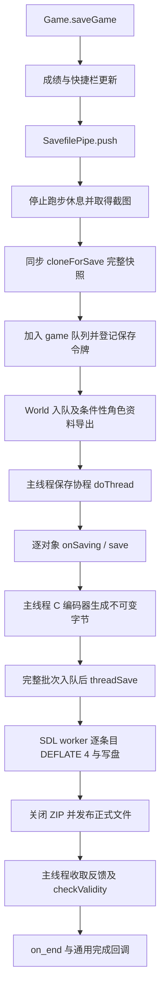

# ToME4 存档系统：结构、保存与加载流程及后续优化代价

后续更新：[0.2.11 实现与验收](save-compaction.md) 已将库存归属、Fearscape 引用清理和
base62 实现为默认关闭的实验。下文保留 0.2.10 时的分析范围；跨对象块压缩仍未实现。

2026-09-14。本文针对 ToME **1.7.6**、固定引擎提交
`624a67329fe2ad440c5b344785a9c73fcf22ae63`，以及 Faster ToME4 **0.2.10**。
目标是**尽量缩小存档，同时不增加保存时间**。本文完成代码分析、只读统计和压缩代理实验，
没有实施下文的新候选，也没有改写玩家基准存档或本体引擎。

目前已交付的短对象编号最符合这个目标：正式 20 组对照中，主档中位数缩小 **7.00%**，
同步保存调用基本持平，整个保存流程中位数缩短 **2.41%**。后续最值得深入研究的是
**精确修复失效引用**与**跨对象分块压缩**。前者可能减少整个对象图的工作量；后者在
本次离线实验中同时明显减少了压缩字节与压缩 CPU，但需要新的写入和读取布局，尚不能
把代理实验称作游戏内的完整保存收益。

## 1. 证据范围与时间约束

本文分别标明四类结论：

- **代码事实**：直接来自上述固定源码，说明引擎实际做什么。
- **测得结果**：来自指定输入、版本和测量边界，不代表任意角色或机器。
- **设计推断**：说明改动为何可能有收益，以及实现必须承担的代价。
- **未验证**：尚缺真实保存、读档、状态回放或故障测试，不能计入已交付收益。

不同数据集不能混用：

| 数据集 | 用途 | 关键边界 |
| --- | --- | --- |
| 保留的 Faster 0.2.8 角色目录 | 文件组成、Map 字段、短编号离线转换、本文分块实验 | 25 文件，21,908,270 bytes；主档 2,859 条目；不含相邻的 `world.teaw` |
| 原始角色目录 | Grok 4.6 报告复核、`in_inven` 结构统计、早期取证 | 22,208,501 bytes；主档 2,849 条目；主档、图片和日志与上一行不同 |
| Faster 0.2.10 正式包 | 短编号的游戏内 A/B | 20 对、40 次保存；每个主档 2,864 条目；另有原版读取器重载与再次保存 |
| 0.2.2–0.2.6 历史实验 | 解释已有优化及尚存的语义边界 | 不是 0.2.10 当前热点的重新测量，不能将旧分项时间相加 |

统一使用十进制 MB，1 MB = 1,000,000 bytes；KiB/MiB 分别以 1,024/1,048,576 为单位。
新增聚合数据与复现脚本见 [技术分析证据](../evidence/faster-tome4-save-system/README.md)。
分析脚本只解析固定编码器的有限语法、读取 ZIP/CRC 或压缩字节，**不执行档内 Lua 或字节码**；
对应输入在读取前后的 SHA256 一致。

“不增加保存时间”至少应同时观察：

1. `Game.saveGame` 同步返回前的 wall time 和主线程 CPU。
2. 从发起保存到 worker 完成、校验及完成回调结束的总 wall time。
3. 主线程最长不可让出片段、画面提交间隔，以及后台 CPU 和峰值内存。

只把压缩移到后台、推迟到空闲重压缩，或者借此前另一个优化的收益抵消本次回退，都不能
证明本次改动满足目标。实验只能判断有无稳定回退，不能保证操作系统调度下每一次保存
都不多花一毫秒。新增格式还必须测读档，否则可能只是把保存成本转给加载。

## 2. 磁盘上的文件组织

角色目录不是一份孤立文件。按固定版保存命名和 World 入口，其典型结构是：

```text
<模块用户目录>/save/
  world.teaw                 跨角色的 World 状态
  <角色名>.quickbirth        快速创建角色的描述
  quick_hotkeys              快捷栏记录
  <角色名>/
    game.teag                Game 根及本次可达的持久化对象
    zone-<区域>.teaz         持久区域及其保留楼层
    level-<区域>-<层>.teal   使用逐层持久化时的楼层档
    cur.png                  存档预览图
    desc.lua                 菜单描述、模块版本、addon、时间等
    last_log.txt             最近的引擎日志
```

不是每个角色都有 `.teal`；另有实体导出 `.teae`，不属于这次 25 文件样本。
`Savefile.init` 对角色名进行清洗并设定目录；World 使用空角色名入队，因此在角色目录的
同级保存。源码见 [Savefile.lua:45](../../../../game/engines/default/engine/Savefile.lua#L45)、
[保存命名入口](../../../../game/engines/default/engine/Savefile.lua#L161)与
[World.lua:36](../../../../game/modules/tome/class/World.lua#L36)。

`.teag/.teaz/.teal/.teaw/.teae` 使用的是 **ZIP 容器**。默认内部每个类实例一个条目，
根条目名为 `main`，其他名字是对象键。正文不是 JSON，也不是一个 Lua 内存转储：它是
由编码器生成的 Lua 程序，其中可包含转义过的函数字节码。

当前 Game 会引用 `zone`、`level`、`player`、`party`、持久楼层等，因此主档本身可以包含
多个楼层。`Zone.leaveLevel` 依据 `persistent` 将楼层放入区域内存、Game 内存，或者另写
`.teal`；`Zone.leave` 在 `persistent="zone"` 时另存 `.teaz`。
见 [Game.defaultSavedFields:123](../../../../game/engines/default/engine/Game.lua#L123)、
[Zone.leave:187](../../../../game/engines/default/engine/Zone.lua#L187)、
[Zone.leaveLevel:876](../../../../game/engines/default/engine/Zone.lua#L876)。

**普通保存不会重写所有历史区域。** 历史区域保存了回访所需的地形、物品、NPC、任务等
状态，不能因“当前不在这里”就删除。目录压缩收益必须区分本次主档收益与区域以后自然
重存时的收益；为了立即缩小整个目录而遍历重存所有区域，本身会增加工作。

## 3. 从保存请求到完成反馈



### 3.1 同步准备和完整快照

本体 [Game.saveGame:2854](../../../../game/modules/tome/class/Game.lua#L2854) 先记录成绩、
更新队员快捷栏，再 `push(...,"game",self)`，随后保存 World，并按设置生成角色资料。
在线资料导出与游戏 ZIP 是不同产物；角色资料中的 gzip 也不是主档的 ZIP 压缩器。

[SavefilePipe.push:103](../../../../game/engines/default/engine/SavefilePipe.lua#L103) 的顺序是：
调用保存前 hook；同一 `type/savename` 已在保存时等待；主档截图；同步 `cloneForSave`；
登记队列和 `saveVersion("new")`；建立保存协程；调用入队后 hook。队列过长或关闭后台保存时
会进入 `forceWait`。所以后台保存仍有同步前段，`push` 返回的 clone 也马上被调用者使用。

[class.cloneForSave:362](../../../../game/engines/default/engine/class.lua#L362) 遍历完整对象图，
用 memo 避免重复克隆表，复制表键和表值，保留元表，但不运行 `cloned`。它并不先读取
最终保存白名单。特殊规则包括 `__SAVEINSTEAD` 和 `__threads`，已有优化保持了原版的
遍历次序相关行为，不能在裁剪快照时忽略这些规则。

因此应区分三个计数：**快照里的 Lua 表数、克隆器返回的对象计数、最终 ZIP 条目数**。
普通表也参与克隆；后来被过滤的字段可能已经复制；类实例才通常成为单独条目。
0.2.2 的真实图差分曾有 127,833 张复制表、509,503 个键值项和 27,373 个本体计数对象，
不能拿这些数减去约 2,850 个 ZIP 条目，就当作可以删除的对象数。

### 3.2 主线程协程与 C 编码器

[SavefilePipe.doThread:157](../../../../game/engines/default/engine/SavefilePipe.lua#L157)
先完整 GC，然后为每个队列项建立 Savefile，写入 `__saved_saveversion`，调用
`saveGame/saveWorld/saveZone/...`，写截图、关闭 Lua 保存器。
通常一次 Game + World 保存还会分别进入 `Savefile.saveGame:256`、`saveWorld:177`
中的完整 GC。此前针对这些完整 GC 的优化没有实装，当前不能把它们视为已取消。

[Savefile.saveObject:142](../../../../game/engines/default/engine/Savefile.lua#L142) 以 LIFO
处理对象队列：先登记对象键，再调用 `onSaving`、对象自己的 `save`，最后 `manualTick`
并在后台模式下 yield。发现新的类实例引用时追加到同一队列；已经排队的实例不会重复写入。

[class.save:443](../../../../game/engines/default/engine/class.lua#L443) 组合过滤器、临时清空
实例元表，再调用 `core.serial.new(...):toZip(self)`。**C `toZip` 本身仍运行在主线程**，
一个大 Map 或长普通表没有内部 coroutine 切片；“每对象 yield”不能限制一个对象的耗时。
`onSaving/save` 也不一定是纯读取：例如 `Level.onSaving:46` 清空迭代字段，`Game.save:744`
更新游玩时间，`engine.Projectile.save:43` 将线路状态转换为可保存字段。

[serial.c:444](../../../../src/serial.c#L444) 为单条目建立从 2 KiB 开始增长的原生缓冲，
遍历 Lua 表并生成正文，随后把文件名与完整字节缓冲交给 C 队列。公开接口只有 `new`、
`threadSave`、`popSaveReturn` 和 userdata 的 `toZip`，没有“把正文返回 Lua”或“提交自定义
字节块”的入口，见 [serial.c:520](../../../../src/serial.c#L520)。

### 3.3 原生后台压缩、发布与回调

Lua 协程把当前批次完整序列化之后才调用 `threadSave`。
[worker:156](../../../../src/serial.c#L156) 只收到不可变字节，不读取 Lua 表、函数或
live Game 图；每个 ZIP 条目使用 **DEFLATE、level 4、默认 strategy**，写完即释放正文缓冲。
Lua 协程不是另一个线程，不能把克隆过程简单放进 coroutine 后就让后台 CPU 读取活图。

原 worker 把队列暂空当作本批结束并关闭 ZIP。因此不能每生成一个对象就唤醒它：早期
fixture 已复现同一 archive 被提前结束、后续又以 CREATE 重开的错误。真正流水化需要
显式 BEGIN/ENTRY/END/ABORT、背压和错误返回，还需定义 ZIP handle 的所有权移交：
`serial_new` 与 worker 都参与 `last_zf/last_zipname` 生命周期，提前关闭后继续生产可能
使用旧 handle。详见 [已验证反例](save-followup.md)。

文件先写为 `*.tmp`。必须准确描述原版的恢复能力：

- [finish_zip:139](../../../../src/serial.c#L139) 在关闭 ZIP 后先删除旧正式文件，再 rename
  临时文件；**这不是已证明无断电窗口的原子替换**，这里也没有显示完整的 fsync/事务协议。
- `checkValidity` 只是挂载 ZIP 并打开 `main`，不逐对象读回、不检查完整对象图或所有 CRC，
  见 [Savefile.lua:747](../../../../game/engines/default/engine/Savefile.lua#L747)。
- 若该检查失败，`doThread` 会用保留的同一快照重试；这段循环没有显式重试次数上限。
- 正常完成后才运行 `on_end` 和通用完成动作。MD5/资料、Steam 与退出等待是已有管线合同，
  新 writer 必须接回这些路径，不能只做到“生成一个可以解压的文件”。

这不是本轮新增故障，也不是要求用户另行操作；它说明更换 writer 的工作量包含恢复协议，
并且现有“保存完成”不能等同于完整语义校验通过。

## 4. 对象图在 ZIP 内的表示及加载

### 4.1 名称是对象键，类名在正文中

原版 [getFileName:130](../../../../game/engines/default/engine/Savefile.lua#L130) 返回
`类名-表地址`，根返回 `main`。名称同时存在于 ZIP 本地头、中央目录、`setLoaded` 声明和
其他条目的 `loadObject` 引用中。0.2.10 将非根名称改为保存器内的十进制编号。

下面只是人为构造的格式示例，不含真实角色内容：

```lua
-- ZIP entry: main
d={}
setLoaded('main', d)
d["__CLASSNAME"]="mod.class.Game"
d["player"]=loadObject('1')
d["focus"]=loadObject('1')
return d

-- ZIP entry: 1
d={}
setLoaded('1', d)
d["__CLASSNAME"]="mod.class.Player"
d["owner"]=loadObject('main')
d["settings"]={["example"]=true}
return d
```

`player` 和 `focus` 指向同一对象，不是复制出两名玩家；`owner` 可以回到根。
读取器通过正文 `__CLASSNAME` 执行 `require` 并恢复方法元表，不依赖文件名的类名前缀。
短编号不改变 `__CLASSNAME`，也不改变字段和引用关系。

### 4.2 原始表示的边界

[serial.c:373–438](../../../../src/serial.c#L373) 的关键分支是：

| 值的类型 | 原版表示 | 优化必须保留的边界 |
| --- | --- | --- |
| 带 raw `__CLASSNAME` 的表 | `loadObject('键')`，并登记独立条目 | 同一实例必须用同一键；不同实例不能仅因内容相同就合并 |
| 普通 Lua 表 | 直接内嵌 `{[key]=value,...}` | 不具备通用普通表身份表；共享普通表可能被多次内联，不能承诺任意普通表环/别名保真 |
| 数字、布尔、字符串 | Lua 字面量，字符串转义包含 NUL 等字节 | `nil/false/0` 不可混同；数字编码和二进制字符串不能粗暴文本替换 |
| 函数 | `loadstring("转义后的 lua_dump 字节码")` | 不是源码模板名，也不等于自动持久化任意闭包 upvalue；受原 VM 字节码规则约束 |
| userdata、线程等 | 不属于普通嵌套表的可保存类型 | 有些类先在 `save` 中转换 native 状态，不能仅按字段类型裁掉快照输入 |

对象表键也可以产生 `loadObject`。但原版处理自身占位符的代码主要替换表值；它不是所有
Lua 图形状的通用无损格式。更换编码器时应保持原有支持范围，并单独测试表键、自引用、
循环、弱表和特殊元表，不能在没有协议设计的情况下“顺便改进”普通表的身份语义。

过滤器还有一个实际实现细节：`serial_tozip:477–490` 先算 allow/disallow，再由存在的
`disallow2` **重新赋值** `skip`，不是逻辑或。`class.save` 清空元表前后读取
`_no_save_fields` 的方式不同；实例 raw 字段与从类继承的字段不能混为一谈。过滤表中
“值为 false”和“键不存在”也不同，因为 C 检查是否为 nil。依照期望中的白名单直接剪图，
可能与当前引擎真正写出的内容不一致。

### 4.3 加载的实际顺序

1. `SavefilePipe.doLoad` 先寻找仍在队列中的同一档案，命中时返回原 baseobject；否则建立
   Savefile，必要时从 Steam 取文件，借 PhysFS 挂载 ZIP 到虚拟 `load_dir`。挂载不等于
   把所有正文解压成磁盘文件。
2. `loadReal("main")` 按对象键打开条目并收集正文；`class.load` 编译正文，并在只提供
   `setLoaded/loadObject/loadstring` 的环境中执行。
3. 正文开始时先 `setLoaded(name,d)` 登记空表，因此其他条目回指它时能复用同一个表；
   当前条目的自引用使用 `LOAD_SELF` 占位，随后由 `resolveSelf` 处理。
4. 按 `__CLASSNAME` 恢复类元表。`loadNoDelay` 对象立即执行 `loaded`；其他对象入延迟队列。
   Game 返回单独的延迟回调，World/Zone/Level 等入口在对应阶段执行该队列。
5. `loaded` 重建运行时资源和索引。例如 `Map.loaded` 重建 C Map、FOV cache、可调用表元表
   和显示结构；`Entity.loaded` 分配新 UID；`GameEnergyBased.loaded` 用新 UID 重建实体表，
   并恢复弱值属性。
6. Zone/Level 等还校验主档认可的保存令牌；旧主档不认识的新区域令牌可能被拒绝。

对应源码：[SavefilePipe.lua:276](../../../../game/engines/default/engine/SavefilePipe.lua#L276)、
[Savefile.lua:446](../../../../game/engines/default/engine/Savefile.lua#L446)、
[class.lua:481](../../../../game/engines/default/engine/class.lua#L481)、
[Map.lua:311](../../../../game/engines/default/engine/Map.lua#L311)、
[Entity.lua:213](../../../../game/engines/default/engine/Entity.lua#L213)、
[GameEnergyBased.lua:43](../../../../game/engines/default/engine/GameEnergyBased.lua#L43)。

由此可见，ZIP CRC 正确只说明字节完整；成功加载一次也不证明所有任务、AI、物品身份和
重访状态相同。跨读档比较原始 UID 数字会产生假失败，应该比较 UID 对应关系与别名图。
磁盘内有普通表中的对象引用时，即使运行时该表曾是弱表，保存当时尚存在的值也会写出；
弱属性需要加载回调重建。弱表不能自动充当“不要保存这条引用”的声明。

## 5. 现有存档空间的成本模型

### 5.1 角色目录与类分布

保留的 0.2.8 样本的只读统计如下；来源是
[offline-results.json](../evidence/faster-tome4-save-size/offline-results.json)。

| 目录内容 | bytes | 比例 |
| --- | ---: | ---: |
| 21 个历史区域档 | 18,749,144 | 85.6% |
| 主档 `game.teag` | 2,662,545 | 12.2% |
| `cur.png` | 432,645 | 2.0% |
| 日志与描述 | 63,936 | 0.3% |
| 合计 | 21,908,270 | 100% |

22 个 ZIP 合计 21,068 条目；未压缩正文 52,508,940 bytes，压缩正文 18,718,145 bytes，
容器开销 2,693,544 bytes。主要类的聚合如下，`main` 另计，不能用文件名前缀推断根的真实类：

| 类别 | 条目数 | 未压缩正文 MB | 压缩正文 MB | 头部 MB |
| --- | ---: | ---: | ---: | ---: |
| `mod.class.Object` | 11,532 | 18.453 | 9.198 | 1.499 |
| `mod.class.NPC` | 576 | 5.603 | 2.080 | 0.071 |
| `mod.class.Grid` | 3,452 | 2.713 | 1.446 | 0.435 |
| `engine.Map` | 60 | 15.065 | 1.612 | 0.007 |
| `engine.Entity` | 3,667 | 2.007 | 1.133 | 0.455 |
| `engine.Object` | 360 | 2.853 | 1.264 | 0.045 |

物品类正文与头部约占目录 48.8%，但包含合法堆叠、装备、商店和职业实例。数量多只是
优化定位依据，不是删除依据。地图正文大，但原本压缩率就很高，15 MB 原文不等于可省
15 MB 磁盘。

### 5.2 名称、对象数、正文与压缩上下文分别计价

这个样本中，一个普通 ZIP 条目的固定本地头与中央目录共 76 bytes，另加两份名称；
每容器还有结束记录等。因此近似关系为：

```text
ZIP 大小 = 各对象压缩正文之和
         + Σ(76 + 2 × 对象键字节数)
         + 容器结束记录及可选额外字段
```

缩短名字可以减少两份未压缩的头部字符串，还减少正文和引用中的同名字符串。
减少真正不必要的对象，能同时省头部、正文、克隆与加载；只是减少一个仍被其他路径引用
的边，则不一定减少任何对象条目。对字段的压缩成本也不能相加：DEFLATE 上下文会让
“删除字段再重压”的差值与独立压该字段的大小不同。

保存时的内存主要是 live 图、完整快照、Lua/C 临时分配、待压缩的原生字节缓冲和 worker
压缩状态同时存在。0.2.10 没有改成边生产边释放的协议。因此减少快照可达表、减少正文
字节、减少长期引用是三类不同的内存优化；Lua `collectgarbage("count")` 也不能测全 C 堆。

## 6. 已实现的优化及其实际贡献

| 已有功能 | 实际改变 | 对本次“缩小存档”的意义 |
| --- | --- | --- |
| 0.2.10 短对象编号 | 保存器内弱缓存分配十进制键，根仍为 `main` | 直接减少 ZIP 名称和对象引用字节；不改变字段或原读档器 |
| 完整快照复制优化 | 只对表查询 clone memo，保持完整图和原特殊规则 | 减少复制 CPU；没有按保存字段裁剪数据 |
| 离线角色资料跳过 | 已知消费者明确丢弃资料时省去生成 | 减少无效导出 CPU；不是删除游戏档字段 |
| 无用 Party 导出准备清理 | 识别固定保存入口及 Cults 包装器后省去未消费的临时 Party 工作 | 已实施；不能再列为新增候选 |
| gzip 状态释放 | 修复已知角色 JSON 导出的 native 状态保留 | 修内存与短输入问题；不改变游戏 ZIP 的 level 4 |
| 保存回调复用 | 同一 Savefile 复用命名与排队闭包 | 减少分配，历史完整保存 A/B 未证明稳定 CPU 加速 |
| 保存 PNG 加速 | 同像素无损 PNG，较快的编码参数 | 减少截图 CPU，但图片变大；不是已有体积收益 |
| 同步快照刷新 | 完整复制中定期绘制受控等待画面 | 改善画面提交间隔，仍是同步复制；不是后台快照 |
| 切图请求合并、加载延迟队列优化 | 同一回调批保留末次自动保存；保持 loaded 队列次序地批量构建 | 减少特定重复工作；显式保存不合并，ZIP 语义不变 |

相关实现与历史证据：
[短编号](../overload/engine/FasterSaveNames.lua)、[完整复制与离线导出](save-stutter.md)、
[Party 清理](export-cleanup.md)、[gzip](gzip-export.md)、[回调复用](save-followup.md)、
[截图与刷新](snapshot-refresh.md)、[保存与加载队列](save-load.md)。
FBO 保护及 500 ms 受击方向提示默认值维持不变，本文也不建议以改变 GC 参数换取体积收益。

正式短编号数据以同一 0.2.10 包、只切换 `compact_save_names` 的 **20 组**为准：

| 中位数 | 关闭 | 开启 | 变化 |
| --- | ---: | ---: | ---: |
| 主档 bytes | 2,667,071 | 2,480,462.5 | −7.00% |
| 同步 wall | 157.76 ms | 159.22 ms | +0.93% |
| 同步主线程 CPU | 141.42 ms | 142.36 ms | +0.66% |
| 完成总 wall | 510.80 ms | 498.49 ms | −2.41% |
| 保存全程主线程 CPU | 416.62 ms | 408.06 ms | −2.05% |

40 次保存、3 次原版读取器重载和 1 次读回后再次保存均通过对应检查；合成对象图使用实际
C 编码器和原版读取器，JIT 开/关各 8,529 项。实机状态对照是选定业务投影，不是完整世界
逐字段证明。环境为 Linux、内嵌 LuaJIT 2.0.2、Xvfb/llvmpipe；Windows、Steam 云保存及
其他角色/地图未实测。原始结果见 [save-names-results.json](save-names-results.json)。

短编号默认开启，设置 `compact_save_names=false` 并重启可关闭；未知命名或生命周期覆盖
会跳过安装。缓存不写入角色，成功 init 和 close 会释放旧缓存，原 native serializer 和
压缩等级不变。旧长名称与新短名称档均可由原版读取器加载。

0.2.8 全目录离线可逆重命名估算为 21.908 → 20.479 MB，减少约 **6.52%**；其中容器开销
减少 961,028 bytes，压缩正文减少 468,037 bytes。它不是已完成的区域迁移：只重存主档时
相当于该目录约 **0.85%** 的即时减少。早期 5 组原型的总耗时 −5.53% 不应用来替代正式
20 组的 −2.41%。完整边界见 [save-size-analysis.md](save-size-analysis.md)。

## 7. 对另一份 Grok 4.6 问题报告的复核

本节回应所阅读的“检查 ToME4 还有哪些影响存档大小的问题”报告。其发现有价值，但
“出现某字段”“可达规模很大”和“能安全删除”是不同结论。下表只采纳已经由本地 ZIP
或固定源码重新核对的部分，不把报告中的估算当作已实现收益。

| 报告主题 | 独立复核 | 采纳与修正 |
| --- | --- | --- |
| 历史区域夹带 Player 与背包/任务 | 原始目录 21 个区域中，**15 个**含 Player，合计 20 条目；主档另 1 条目；有区域含 2 个，也有 6 个不含 | “每个 `.teaz` 都保存一名玩家”不成立。21 个 Player 正文共 1,658,172 bytes；不能当作可删独占图或压缩收益 |
| `in_inven.id` 为表 | 2,955 个物品有归属字段；id 为 table 1,037、number 1,791、string 127 | 1,037 个表都有内部数字 id，但这不足以证明都能直接替换；表内出现 5,156 次对象引用，不是 5,156 个独立对象 |
| FOV/AI/距离图可重建 | `distance_map` 保存历史可见时间/距离；`ai_actors_seen` 保存曾见过的目标，AI 实际使用 | 不能统一加入 `_no_save_fields`。`stripForExport` 会清理它们，不说明继续游戏时也能清理 |
| 流沙对象反复带函数 | 沙虫区域有 344 个 `engine.Object`；固定 `sand.lua` 确实逐实例设置 `act/dig/tooltip` | 值得调查模板/函数表示。对象是会塌陷、伤害角色、记录召唤来源的游戏机制，不能当装饰删除 |
| Fearscape 捕获者残留 | 固定进入路径写 `demon_plane_trapper`，死亡回调依赖它，退出路径未显式清除；早期取证确认孤儿链 | 可针对退出成功后的生命周期修复；不能在死亡回调前清空，也不能删除所有非当前地图粒子 |

ZIP 与归属聚合见 [grok-zip-check.json](../evidence/faster-tome4-save-system/grok-zip-check.json)、
[inventory-ids.json](../evidence/faster-tome4-save-system/inventory-ids.json)。
归属字段的原文总计 712,540 bytes，包含 table/number/string 三类及 actor 引用；它不是
“把 table id 改为数字”可以全部省掉的大小。归属 actor 指向 Player 的 2,002 次出现也
不能直接删除 owner。

源码上的反证尤其明确：

- [ActorFOV.lua:106](../../../../game/engines/default/engine/interface/ActorFOV.lua#L106) 写入
  `game.turn + radius - sqrt(sqdist)`，并非每次都清空整张旧距离图；
  [distanceMap:214](../../../../game/engines/default/engine/interface/ActorFOV.lua#L214) 暴露
  这些历史值给追踪逻辑。`engine/ai/simple.lua:50,112` 和
  `mod/class/interface/ActorAI.lua:819` 的追踪/逃跑会读取它们，无法仅由当前 FOV 等价恢复。
- [ActorAI.lua:65](../../../../game/engines/default/engine/interface/ActorAI.lua#L65) 保留
  `ai_actors_seen` 内容，只恢复弱键元表；[NPC.lua:201](../../../../game/modules/tome/class/NPC.lua#L201)
  依靠它限制敌人之间的连续仇恨传播。这是历史状态，不是任意可丢缓存。
- `computeFOV` 本身还会通知 `seen_by/updateFOV`，有位置、回合缓存快路；重新计算的
  时机与顺序也可能改变 RNG/目标行为。`Actor.stripForExport:355` 的用途是生成清理过的
  导出对象，不是恢复一场进行中的游戏。

## 8. 后续方案：实现路径、收益依据和完整代价

下列工作量是**工程估计，不是测量或交付承诺**：假设一名熟悉固定 ToME 源码的开发者，
可复用现有差分测试框架；人日含实现和主要回归，广泛平台/DLC 验证可能再增加。优先级
同时考虑“缩小且不增加时间”、收益证据、改动范围与兼容性，并非只按代码是否容易排序。

### A. 精确规范化 `in_inven.id`，解除已经失效的归属边

**路径与依据。** `getInven:92` 本来支持数字、字符串和直接的 inventory 表；
`addObject:187` 将原参数传给 `onAddObject`，后者在 `:317` 原样写入 `in_inven.id`。
普通表内联意味着一个 table id 会再次写出其中的物品引用。早期取证另确认两条旧归属记录
额外保留 30 个不在直接 inventory 中的物品，但这批是旧输入，不应外推为当前全量可删数。
见 [ActorInventory.lua](../../../../game/engines/default/engine/interface/ActorInventory.lua#L92)
及 [早期取证](../evidence/faster-tome4-save-forensics/README.md)。

新增归属可以在确认 `self.inven[inven.id] == inven` 的已识别路径，将标准记录的 table id
规范为现有数字 id；保留 actor、物品数量、已有 hook 收到的原参数与顺序。字符串 id 是
合法输入，不需要顺手改写。匿名表、特殊 inventory、未知 addon 覆盖应回退。
旧档经过普通表内联后，id 表可能已经失去与 actor.inven 的原始别名，不能只看内部 `.id`
就迁移；应按真实归属、堆叠及装备关联做独立验证。

- **复杂度**：新增路径约 2–4 人日；旧档幂等迁移及组合回归另约 4–8 人日。
- **CPU 与保存时间**：新增路径可为常数级身份判断；旧档一次迁移需扫描相关库存。正确
  解除无用边后可以减少 clone、序列化和压缩；不应每次保存额外扫描整个对象图。
- **内存与磁盘**：可能少保存重复内联内容和独占保留图；如果对象仍由其他合法路径引用，
  不会减少其条目。当前只有原文规模与结构计数，尚无安全迁移后的压缩 bytes/RSS 实测。
- **读档与兼容**：标准数字 id 已被原版 API 支持，纯规范化可沿用原读取器；但误认旧归属
  可能改变移除、装备或转化行为。不能删除 `in_inven.actor` 来追求更大的数字。
- **维护与失败恢复**：需要跟踪本体/DLC 库存 hook；迁移可重复执行，证据不足跳过，不
  直接编辑 ZIP。验证失败前不写新档，不增加强制 GC；旧基准作为恢复依据。
- **缺失验证**：拾取、堆叠/拆堆、交换装备、转化、丢弃、特殊库存、旧档重载与再次保存，
  并比较独占可达对象而非引用出现次数。

### B. Fearscape 等已结束机制的引用清理

**路径与依据。** [shadowflame.lua:243](../../../../game/modules/tome/data/talents/corruptions/shadowflame.lua#L243)
记录捕获者，`:245–251` 的死亡包装需要它；退出在 `:286–367` 经 tick-end 回调恢复地图、
角色、物品和死亡回调。早期静态取证确认 Player → 死 NPC → Astar → 孤立 12×12 Map
的保留链及 135 个粒子记录。它证明生命周期问题，不证明这些记录是严重卡顿的主因。

可先在**原退出成功完成且回到来源 Level 后**清除仍匹配该次施法者的 target 引用；旧档
修复再核对施法者死亡、目标死亡包装已恢复、该 Map 不属于合法持久楼层等条件。

- **复杂度**：约 3–7 人日，若覆盖旧档迁移和不同退出分支，约 1–2 周。
- **CPU、内存、磁盘**：退出时少量检查，不在每次保存追加全图扫描；独占链消失可能同时
  少复制、少编码、少重建 native emitter。尚缺当前 0.2.10 的独立存档体积与总时间 A/B。
- **读档与兼容**：记录不存在本身不需要新 ZIP 格式，原版读取器可读；但失误会影响仍在
  进行中的技能、死亡处理、物品带回。清引用和关闭 emitter 也不是同一操作。
- **维护与失败恢复**：需匹配技能源码和包装器，保留失败退出原行为；迁移幂等且不强行
  摧毁地图。已写出的裁剪是持久的，不能靠关闭 addon 自动找回误删状态，所以先在副本
  验证所有退出分支。
- **缺失验证**：主动解除、施法者/目标死亡、缺少可放置格子、临时区切换、仍持续的技能、
  合法历史地图及重访。仅删除粒子列表不是本方案。

### C. 历史区域里的玩家图：按引用来源处理，而不是按类删除

**路径与依据。** 历史区域保存是从 Zone 根独立遍历；跨文件没有全局对象身份表。
`Game.leaveLevel:844–881` 通常移除直接的玩家/队员楼层实体，但其他引用仍可能把 Player
及其背包、任务拉入 Zone 保存。15 个区域、20 个 Player 是确认的分布；不是其中全部
对象都失效，也不是全部背包/任务都只有这一条保留路径。

先记录每份 Player 的反向引用来源，区分 `in_inven`、AI 历史目标、召唤者、事件闭包关联、
Party 和合法时间/临时副本。对确认过期的字段应用生命周期规则；若要让合法引用直接指向
主档中的唯一玩家，则需要显式的跨档实体键、绑定时间和对象替代语义，属于更深的数据设计。

- **复杂度**：聚合来源审计约 3–5 人日；逐字段修复约 1–3 周；通用跨档绑定至少 3–6 周，
  无法视为一次 `_no_save_fields` 修改。
- **CPU 与内存**：正确清理独占图可多阶段获益；每次保存做全图反向索引或哈希则有显著
  成本，应尽量在事件生命周期维护。跨档共享缓存又会增加常驻内存。
- **磁盘**：可能是较大来源，但目前 Player 原文和 Object 数量没有给出可安全裁剪的
  压缩独占集合；不能用“全目录物品数减当前主档物品数”估算可删量。
- **读档与兼容**：断边保留合法状态可不换容器；绑定旧区域 Player 到当前玩家可能把旧
  位置、状态、关系升级为新值，改变 AI/事件，必须定义语义。新增跨档键还使老读取器
  无法直接恢复关系。
- **维护与失败恢复**：跨档方案必须保证主档和区域属于同一保存版本；中断时不可留下
  指向未发布主档的键。未知类/任务/DLC 关系保持原对象图，并保留可读旧格式。
- **缺失验证**：所有有 Player 的区域反向图、独占压缩数据、原路重访、队伍切换、召唤、
  时间副本、任务状态与失配保存令牌。优先做这个审计，不优先承诺删除比例。

### D. Map 探索与可见字段的无损紧凑编码

**路径与依据。** `Map.save:234` 已排除 `_map/_fovcache/fbo` 等重建项；不能把它们再次
计为待删除收益。保留下来的 `lites/seens/infovs/has_seens/remembers` 是 Lua 稀疏表，
坐标键通常为 `x+y*w`。`Map.loaded:320–377` 的 setter 接受 `v ~= nil`，因此显式 false
是可表示状态；`applyLite` 等又会把数值可见度写进 `seens`。

[字段统计](../evidence/faster-tome4-save-system/map-fields.json) 对 60 个 Map 得到：

| 字段 | 原文赋值 bytes | 实际值形状 |
| --- | ---: | --- |
| `lites` | 1,953,095 | 151,670 true，160 false |
| `seens` | 56,378 | 3,519 个数值 |
| `infovs` | 47,822 | 3,747 true |
| `has_seens` | 963,003 | 76,372 true |
| `remembers` | 1,518,084 | 117,904 true，9 false |

五字段共 4,538,382 原文 bytes。定位实验仅在内存里**破坏性删除**这五个赋值再压缩：
主档 10 Map 的压缩正文 174,674 → 100,766 bytes；历史 50 Map 为
1,437,090 → 689,470 bytes。差值 73,908/747,620 bytes 仅说明成本位置，**不是可交付的
删除方案、bit packing 收益，亦不是一般压缩率的数学上界**。

可行候选是：对确认类型和键域的字段保留“缺失/false/true”状态，对数值另做原精度编码；
稠密区域可用位平面，连续区可用游程，稀疏区域用索引差分。超出已知类型、含额外字段或
特殊元表时沿用普通表。解码必须在原 `Map.loaded` 消费这些表之前完成。

- **复杂度**：类型/键域审计与原型约 3–5 人日；带失败路径和不同地图回归约 1–2 周。
- **CPU 与保存时间**：每次编码仍需遍历格子；Lua 位操作、字符串装配和选最优格式会花
  CPU，但可能替代更多的 C 文本编码/压缩。若先完整 clone 再编码，不会省掉原快照成本。
  需比较简单单遍编码，不能默认为多方案试压免费。
- **内存与磁盘**：压缩前可小很多，压缩后应以实际 packed+ZIP bytes 为准；转换时可能
  同时持有原表和新字符串。为从 clone 阶段受益而把运行时表长期改成位图，会触及所有
  直接表访问点，复杂度远高于仅保存时编码。
- **读档与兼容**：追加 packed 字段加 `Map.loaded` 解码可由 addon 实现，但旧读取环境
  没有 decoder 时不能保证可读。另一条路是生成原读取器可执行的重建 Lua，保留旧类与
  字段结果；这需要自定义编码器和专门兼容测试，不是现有 C `toZip` 的选项。
- **维护与失败恢复**：版本化编码、原文回退、严格长度/键界检查；异常不能静默当作未探索。
  不要在 live Map 上先删表再尝试压缩，失败必须保留原图和旧文件。
- **缺失验证**：显式 false、数值精度、非矩形/大型地图、nil/0 区别、额外键、不同地形、
  迷雾显示、自动探索/行走、读档 CPU 与所有保存阶段的 A/B。

### E. 重复实例函数与模板：先从流沙对象限定实现

[sand.lua:53–91](../../../../game/modules/tome/data/general/grids/sand.lua#L53) 每次挖开不稳定
沙壁时创建 `engine.Object`，逐实例带 `act`、`dig`、`tooltip`，以及 `temporary`、
`old_feat`、`summoner`、坐标。`act` 消耗能量、降低寿命、恢复地形并可能造成窒息和伤害，
这些实例有真实游戏状态，344 个对象不等于 344 个无用效果。

可以把**已知固定行为**放入专用类/版本化模板，实例只存必要状态；未知回调继续保留原
函数字节码。另一个方向是编码器中的字节码字典，减少重复 blob，同时加载时按原规则
创建每个函数。后者可避免强行合并对象身份，但同样需要编码/读取设计。
任意两个函数即使字节码相同，也不能不检查 environment、upvalue 和 addon 覆盖就认为
可以共享一个函数实例；固定流沙行为移到类方法与通用函数字典应分别验证。
`summoner/target` 等引用也不能直接改成原 UID 数字：经验、伤害和追踪消费者需要对象，
原 UID 又会在加载时重新分配；若要改为 ID，须设计完整的持久键和重绑定过程。

- **复杂度**：一个固定机制的模板试验约 4–8 人日；生产迁移和旧行为版本兼容约 2–3 周；
  通用函数字典另有编码器工作量。
- **CPU、内存、磁盘**：省重复 lua_dump、转义、压缩及函数加载；但相同 callback 在同一
  函数环境下共享不等于原来每实例函数身份相同。通用匹配/散列本身也花 CPU。当前没有
  按字段隔离出的可交付压缩节省，不把全部 `engine.Object` 正文算作函数开销。
- **读档与兼容**：新类需要对应 addon；若方法随版本变化，旧存档的实例行为可能随之
  变化，应记录模板版本并保留旧实现。不能凭名字相同替换自定义 `act/dig`。
- **维护与失败恢复**：涉及代码版本、函数环境、迁移顺序和旧回调保存；未知模板版本应
  明确拒绝或读旧正文，不能用默认类悄悄加载。迁移仅限副本中的已识别实例。
- **缺失验证**：塌陷倒计时、重复挖掘重置、召唤来源、伤害/经验归属、地图替换、跨层
  能量恢复、函数环境与其他区域的 `engine.Object`。适合窄原型，不宜先改所有类。

### F. 堆叠物品采用模板加差异，仍保留每个实例身份

[engine.Object.stack:141](../../../../game/engines/default/engine/Object.lua#L141) 将实际对象
放入 `stacked`；`unstack:155` 返回这些实际实例，`getNumber` 为 `1+#stacked`。
`canStack` 主要看 stacking 标识，ToME 再加鉴定条件，并没有检查所有字段完全相同。
早期取证的一个堆叠有 422 个对象、512,883 bytes 原文；46 个恶魔种子的可达子图约
733,186 bytes，后者还有职业机制所需 NPC，不能仅保留数量。

可研究“共享模板 + 每实例差异 + 每实例对象键”，解码后恢复完整独立对象与原堆叠顺序。
只把一堆替换为 `count` 会丢掉差异、外部引用和回调，不是无损优化。

- **复杂度**：一个严格白名单物品类型的差异原型约 1–2 周；完整身份/引用/迁移支持约
  3–6 周；泛化到任意物品和 DLC 通常更长。
- **CPU 与保存时间**：需识别模板、比较全部有效差异、处理引用；每次深比较可能比当前
  直接 C 编码更慢。最好复用已知模板键，新增一次全图 hash 不应被隐去。
- **内存与磁盘**：潜在节省重复字段、字节码与头部，但保留所有实例 ID 仍有
  索引成本；仅磁盘压缩不会减少运行时实例数。编码阶段还可能同时占有模板和旧实例。
- **读档与兼容**：必须恢复每个实例、别名、外部表键、loaded 顺序及 UID 对应关系；
  模板还原需要版本化协议或生成兼容 Lua。未知差异和缺失模板应回退完整对象正文。
- **维护与失败恢复**：物品字段和 DLC 变化频繁；不能让升级后的模板覆盖旧随机词缀、
  充能、资源或种子宿主。跨档依赖会加重恢复成本，应先限于单个存档容器。
- **缺失验证**：分堆顺序、转化、交易、装备、鉴定、外部对象引用、特殊种子、模板更新、
  故障中断，以及短编号已开启时的增量收益。

### G. 跨对象分块压缩：目前最强的深入方案证据

**问题。** 当前每对象独立 DEFLATE，重复的类字段、模板和函数字节码无法在对象之间
共享压缩上下文，同时每条目重复建立压缩流。把多个对象正文放入共享块，既可能增加
相邻重复匹配，也减少流初始化和小文件头。它不要求先猜哪些游戏字段能删。

本次代理实验在 0.2.8 固定输入上先做可逆短编号，再保持原 ZIP 条目顺序、按对象边界
组块；不跨 archive。level 4、memLevel 8、默认 strategy，2 次预热、7 次轮换测量。
输入块在计时前准备；逐块解压还原检查通过，原始正文重压大小与原 ZIP 吻合。
留档的第二批结果见 [block-proxy.json](../evidence/faster-tome4-save-system/block-proxy.json)
及 [block_proxy.py](../evidence/faster-tome4-save-system/block_proxy.py)。

| 主档压缩单位 | 单位数 | 压缩正文 bytes | 压缩 CPU 中位数 |
| --- | ---: | ---: | ---: |
| 逐对象，短编号基线 | 2,859 | 2,239,481 | 59.31 ms |
| 64 KiB 目标块 | 84 | 900,373 | 23.39 ms |
| 256 KiB 目标块 | 25 | 838,504 | 23.29 ms |
| 1 MiB 目标块 | 6 | 821,575 | 23.36 ms |
| 整个 archive 一个块 | 1 | 816,571 | 23.37 ms |

| 22 个 archive 合计 | 单位数 | 压缩正文 bytes | 压缩 CPU 中位数 |
| --- | ---: | ---: | ---: |
| 逐对象，短编号基线 | 21,068 | 18,250,108 | 474.29 ms |
| 64 KiB 目标块 | 680 | 7,692,150 | 195.37 ms |
| 256 KiB 目标块 | 195 | 7,130,502 | 194.41 ms |
| 1 MiB 目标块 | 56 | 6,995,710 | 194.43 ms |
| 每 archive 一个块 | 22 | 6,953,399 | 194.24 ms |

256 KiB 案例的**压缩正文**分别减少 62.56%/60.93%，压缩 CPU 减少 60.73%/59.01%。
这些不是 `game.teag` 大小、整个目录大小或总保存时间的减少百分比。实验不包含组块复制、
对象边界描述、索引、ZIP 封装、CRC、编码器、磁盘、游戏调度、新读取器或云同步。
块是字节代理，并不是可以交给原 `class.load` 执行的完整 entry 程序。

目标块大小也不是硬内存限制：不拆对象的策略在全目录留下最大 **1,362,489 bytes** 的
对象；主档的 64 KiB 方案最大块为 182,834 bytes。若要求每个片段硬性不超过预算，仍须
实现大对象的分片编码/读取，不能借“256 KiB”字样作承诺。

**可以实现的架构。** 保存器仍分配对象键并按原顺序执行 `onSaving/save`；一个可取字节的
编码器输出各对象正文；块层保存边界与 `对象键→块、偏移、长度` 索引。新 `loadReal`
按索引取正文，继续交给原 `class.load`，保留 `setLoaded` 先登记及原 loaded 时序。
初版可把 `main` 保留为普通根条目，并另有格式版本与索引；遇到新格式必须显式选择
对应读取器，不能让旧读取器因缺条目返回 nil 而悄悄得到残缺对象。

- **复杂度**：离线有索引原型约 3–5 人日；Lua 编码器+受控 ZIP writer+读取器约 2–4 周；
  若要求保留后台压缩，还需有界原生 worker/桥接及平台验证，完整工作约 4–8 周起。
- **CPU 与保存时间**：目前有约 36 ms 主档压缩 CPU 的局部空间，但新编码器和索引可能
  吃掉它；原生 `toZip` 没有暴露字节。直接用 `fs.zipOpen/add` 可写 ZIP，却是在主线程
  压缩，不能宣称保留了原后台 CPU。兼容原字节的 C helper/配套 worker 可保留后台，但
  意味着原生构建与分发；本轮禁止修改本体源码，故它只是后续设计，不是当前改动。
- **内存**：简单 `table.concat` 组块会同时持有对象正文和整块；现有完整批次缓冲还在。
  正确 BEGIN/ENTRY/END 流水与背压能逐批释放，但需测高水位。大对象必须单独处理，
  读取缓存可设置块数/字节上限，不能缓存所有解压正文后声称省内存。
- **磁盘**：有强压缩信号，并且能减少大量头部；新索引、记录边界、版本标记和校验有
  额外字节。需要生成真实候选容器再称量，不从这张表直接推算“目录缩小六成”。
- **读档**：会多解压同块的邻居，随机访问可能变慢；缓存不当还会反复解压同块。另一方面
  少流初始化、少小条目查找可能更快，必须实测。256 KiB 已接近更大块的压缩效果，可
  优先比较 64/256 KiB，而不是直接整个 archive 一个巨大块。
- **兼容与维护**：ZIP 外壳可以保持，但内部布局和索引是新协议，原版 reader 不能直接
  按对象名取条目。需要旧格式读取、未知版本拒绝、明确的 addon 依赖/回退，以及关闭
  功能后如何读已经生成的新档。保留所有旧对象条目来兼容会损失核心体积收益。
- **失败恢复**：只有所有块、索引和根一致后才发布；保留旧正式文件到提交成功，定义
  BEGIN/END/ABORT、缺块/截断/重复键、压缩失败、磁盘满、退出和云同步行为。块损坏会
  连带多个对象，索引损坏可能影响全档；至少做块 CRC、索引一致性及对象引用完整性检查。
- **缺失验证**：有索引真实容器大小，编码/组块 CPU，RSS/C 堆峰值，完整 game+world/
  zone 保存，cold/warm 读档，完整图语义、逐动作回放、跨平台与故障注入。压缩微实验
  通过仅足以支持继续原型，不足以默认发布。

这项方案工程量大，但当前数据足以说明“不增加时间”并非与它天然矛盾：降低每对象重复
压缩工作有真实空间。应先用最小有索引格式检验这些空间能否覆盖新编码成本，再决定
是否承担生产 writer 的长期维护。

### H. 按实际保存消费者裁剪快照

**边界。** 这是 CPU/内存候选，若裁掉的东西本来不写盘，就没有直接的存档大小收益。
`Game.save` 的白名单不包含所有保存消费者：metadata、在线角色日志、时间、描述、UUID
等待界面、自定义 `onSaving/save` 等仍会读取快照其他字段。只按白名单复制会破坏这些行为。

0.2.5 的 raw 图审计里，`uiset` 分支可达 36,899 表，但删该根边的独占表只有 694；
`tooltip` 独占 1,039 表，约该次 raw 图 0.81%。不能将共享分支规模都计为收益。
见 [save-followup.md](save-followup.md) 与 [snapshot-next-analysis.md](snapshot-next-analysis.md)。

- **复杂度**：少量根字段和固定消费者描述约 1–2 周；扩展到所有类及 DLC 约 3–6 周以上。
- **CPU、内存、磁盘**：可能省复制与后续 GC，但建立依赖扫描也耗时；本来被保存过滤的
  字段只省内存/CPU，磁盘可为零。预扫描全图再复制可能得不偿失，应整合到已验证的克隆。
- **读档与兼容**：若最终保存数据相同，原版 reader 保持兼容；`__SAVEINSTEAD`、
  `__threads`、元表、弱表和遍历顺序会使“少走一条不保存的边”仍改变保留下来的图。
- **维护与失败恢复**：要维护每个消费者合同；遇未知 hook/覆盖在本次保存前回退完整
  clone。不能先在 live 图上试调用 `save` 获取白名单，也不能失败后留下裁剪过的活图。
- **缺失验证**：完整克隆差分、所有消费者输出、弱表/finalizer 反例、在线资料、投射物
  转换、Cults 禁存档及读回。它可与真正的体积方案配合，不能代替体积方案。

### I. 增量、跨档去重与新编码器的更远方案

**增量或跨档对象库。** 为对象建立稳定身份，将未变内容或模板存入共享库，主档/区域只
写引用和修改。理论上能减少重写，但短编号只保证一次 Savefile 内稳定，不能直接拿作
跨次缓存键：它依赖发现/遍历顺序，旧 native 名称也来自本次 clone 地址而不稳定。
普通嵌套表原地修改、`onSaving/save` 副作用、函数和弱引用均会使 dirty 标记失效；
直接 Lua 字段写入不会自动通知缓存，扫描并 hash 全图同样有成本。

工程量估计 6–12 周起；需要稳定键、失效策略、版本快照、垃圾回收和合并。常驻缓存增加
内存；delta 链可让最新写入更少，却让累计目录更大，定期合并会增加 CPU/I/O；读档必须
同时读基底和增量，缺失一段可能使多个区域不可用。旧 reader 不兼容，Steam/备份需提交
整个一致集合，不能任意删除看似旧的共享块。当前没有 dirty 比例、hash 成本、增量目录
增长或恢复实验，不作为下一项发布目标。

**更紧的 Lua 正文或二进制字段编码。** 去多余换行、紧凑数字/数组、共享字段名等可减少
原文，但独立 DEFLATE 已压缩大部分重复语法；需要先测真实增量收益。保持合法 Lua 和
原 `setLoaded/loadObject` 可争取原版读取器兼容；改为二进制对象流则需要完整新 reader、
版本、函数/数字编码与错误边界。窄编码器原型约 1–2 周，完整兼容序列化器约 4–8 周起。
CPU 可能减少也可能增加，构建字符串和解码表有峰值内存；数值精度或对象键变化会产生
难以恢复的语义损坏。建议作为分块 writer 的受控子项目验证，不另开一套未测协议。

## 9. 当前不适合直接采用的方案

### 9.1 提高压缩等级

原 C writer 的等级硬编码为 4，Lua serial API 不提供参数。只读真实主档正文的内存对照：

| DEFLATE 等级 | 压缩正文 bytes | 压缩 CPU 中位数 |
| --- | ---: | ---: |
| 4 | 2,296,903 | 61.88 ms |
| 6 | 2,236,272 | 79.01 ms |
| 9 | 2,227,106 | 114.51 ms |

4→6 仅减少 60,631 bytes 压缩正文、相当于主档约 2.3%，压缩 CPU 却多约 28%；4→9 更差。
这是代理实验而非总保存计时，但已足以否定“直接调高等级没有代价”。把同样工作推迟到
空闲重压缩还会增加二次读写、存档版本竞争和云同步处理，不符合本次时间约束。
换更快的 DEFLATE 实现可以另做原生研究，不能从接口名字推断速度、兼容性或打包成本。

### 9.2 直接删 AI 记忆、历史区域、物品、粒子或保存令牌

`distance_map/ai_actors_seen` 的历史语义已由源码确认。历史区域和种子 NPC 有回访/职业
用途，粒子记录也不全是可丢缓存；`__savefile_version_tokens` 用于主档与区域的相容判断。
删除它们可能减少字节与时间，但改变游戏或破坏恢复，不能计作满足目标的无损优化。
可研究具体生命周期、精确保留语义的紧凑表示，不能套一个全局“cache”过滤名单。

### 9.3 合并完整 GC、`step` 到第一次完成、提前唤醒原 worker

[test_save_followup.lua](../tests/test_save_followup.lua) 已有实际反例：首次 GC 的 finalizer
可能才释放另一对象的最后强引用；完成正在进行的旧标记周期也不等于原 full GC 屏障。
提前唤醒 worker 又会误认 archive 完成。它们还不直接缩小持久化数据。
正确 GC 屏障、冻结事务与新 worker 都可以研究，但属于有独立语义成本的系统设计。

### 9.4 截图与日志的剩余空间

当前截图、日志和描述合计约目录 2.27%。0.2.6 快速 PNG 采用同像素无损编码，但历史
分项实验的 PNG 326,894 → 415,443 bytes；它用较大图片换更少编码时间。
直接恢复高压缩不能视为免费的体积优化。可试单一、便宜的 PNG filter/参数组合，保持
同帧像素和 metadata 后测完整时间；预计 2–4 人日即可做窄实验，但收益上限受当前占比
限制，读档解码也需测。新缓冲会占内存，失败要保留原截图路径；缩分辨率/有损编码会
改变预览内容，不在当前默认范围。

日志上限本体已有 5,000 条，进一步截断会减少诊断内容；即使 CPU 和磁盘都少，也不是
保持同一功能的收益。这里优先级低于结构性重复，不建议为几十 KiB 改变默认日志策略。

## 10. 推荐顺序与验收门槛

| 推荐阶段 | 工作 | 为什么先做 | 成功后才能宣称什么 |
| --- | --- | --- | --- |
| 已完成 | 默认短编号 | 兼容原版 reader，正式 20 对测量与回归充分 | 当前测量范围内主档 −7%，同步基本持平；历史目录收益随自然重存生效 |
| 下一轮窄改动 | `in_inven` 新增路径规范化、Fearscape 成功退出清理 | 具体机制可定界，可能同时减少图、字节和加载资源 | 只在各自实测副本证明的对象集合与时间范围内报告收益 |
| 同期只读诊断 | 历史 Player 反向引用与独占可达图 | 历史档占目录大头，但删除安全性尚未证明 | 明确哪些字段保留了什么，不能先报目录减少百分比 |
| 深入原型优先 | 有索引的 64/256 KiB 分块容器与加载 | 已有显著的字节与压缩 CPU 信号，值得承担较高工程量 | 完整编码/封装/读档 A/B 后，才判断“不增加保存时间” |
| 后续有界原型 | Map 三态/数值编码，固定流沙模板 | 有准确字段和机制入口，能做局部语义回归 | 实际 packed 后的 ZIP 增量收益及读档代价 |
| 较后 | 通用堆叠模板、全图快照裁剪 | 泛化的字段、身份、消费者合同复杂 | 不能用局部 clone 或未压缩 bytes 代替总保存和磁盘结果 |
| 长期研究 | 跨档对象库、增量快照、新二进制协议 | 必须完整处理版本、依赖链、合并和恢复 | 系统级基准与跨平台恢复验证完成后再定是否发布 |

每个新候选应以 **0.2.10 短编号已开启**作为当前基线，不能重复计入已有的命名收益。
性能样本使用相同源存档的独立副本、固定观察边界、预先确定组数与交替顺序，保留慢样本。
正式计时保持生产 GC；诊断 hook 可能触发兼容回退，应分别验证“确实安装”和“不扰动的
性能测量”。同时保留游戏内正常保存、`forceWait`、切区保存和读回再存。

对字段或格式候选，最低验证应包括：

- 持久化完整字段、对象数量、共享/循环/表键、函数及二进制字符串；`__SAVEINSTEAD`、
  `__threads`、元表/弱表和保存回调次序；UID 按对应关系比较。
- 角色、队伍、任务、背包、地图可见状态、AI 追踪、技能/投射物；读档后固定动作回放，
  包含区域重访和多次保存，不能只比较保存当下的回合未变。
- 主线程 CPU、总完成 wall、最慢片段、原生/Lua 内存和磁盘；新格式还测随机读档、
  最大块、缓存淘汰、长时间累计增量与冷启动。
- 按改动范围注入编码错误、缺块、坏 CRC、重复 ID、磁盘满、退出中断和失败后再次保存；
  检查旧正式档仍可恢复，且不会上传未完成版本。读旧格式、关闭功能、未知 addon/版本
  与 Windows/Steam 等未测平台应有明确边界。

本文的新工作停在分析与代理实验。生产默认行为仍是已验证的短编号和既有 Faster 优化；
后续是否采用分块、地图编码或引用迁移，取决于上述完整成本与语义验证。

## 11. 固定源码与证据索引

源码行号均指开头固定提交；引擎链接相对当前 `t-engine4` 工作区，addon 文档和证据链接
相对本仓库。主要入口如下：

| 文件 | 本文实际核对的关键位置 |
| --- | --- |
| [engine/Savefile.lua](../../../../game/engines/default/engine/Savefile.lua) | 45 init；111 去重排队；130 命名；142 序列化队列；161/240/334/371/408 各类文件；446–493 引用恢复；557 Game 加载；747 基础校验 |
| [engine/SavefilePipe.lua](../../../../game/engines/default/engine/SavefilePipe.lua) | 103 push；125 同步 clone；157 doThread；186 唤醒 worker；199 校验/重试；249 forceWait；276 加载与令牌 |
| [engine/class.lua](../../../../game/engines/default/engine/class.lua) | 236 完整克隆；362 cloneForSave；443 过滤器和 C 接口；481–515 deserialize/class.load |
| [src/serial.c](../../../../src/serial.c) | 37 字节队列；139 发布；156 worker；190 level 4；257 serializer；338 字符串/函数；373 表分支；444 toZip；520 API |
| [src/physfs.c](../../../../src/physfs.c) | 207 zipOpen；235 zip:add 的同步压缩参数 |
| [mod/Game.lua](../../../../game/modules/tome/class/Game.lua) | 744 save；844 离层；2801 令牌；2812/2818 hooks；2854 保存；2888 截图 |
| [engine/Game.lua](../../../../game/engines/default/engine/Game.lua) | 123 保存字段；321/342 tick-end 队列 |
| [engine/Zone.lua](../../../../game/engines/default/engine/Zone.lua) | 187 离区保存；798 loaded；808 载入区域；876 离层持久化；983 加载层 |
| [engine/Map.lua](../../../../game/engines/default/engine/Map.lua) | 210 初始字段；234 save；251 native Map；311 loaded；320–377 setter；651–695 数值可见度 |
| [engine/Object.lua](../../../../game/engines/default/engine/Object.lua) | 58 loaded；123–193 堆叠身份及拆堆 |
| [mod/Object.lua](../../../../game/modules/tome/class/Object.lua) | 145 altered；2501 可堆叠条件 |
| [ActorInventory.lua](../../../../game/engines/default/engine/interface/ActorInventory.lua) | 92 getInven；141 addObject；317 归属记录；323 移除 |
| [ActorFOV.lua](../../../../game/engines/default/engine/interface/ActorFOV.lua) | 31 初始化；51 快路；106 历史距离；197 updateFOV；214 distanceMap |
| [engine/ActorAI.lua](../../../../game/engines/default/engine/interface/ActorAI.lua) | 65 恢复弱表；142 历史见敌记录 |
| [mod/NPC.lua](../../../../game/modules/tome/class/NPC.lua) | 193 seen_by；201 连续仇恨传播门槛 |
| [mod/ActorAI.lua](../../../../game/modules/tome/class/interface/ActorAI.lua) | 819–845 使用距离图逃跑 |
| [engine/ai/simple.lua](../../../../game/engines/default/engine/ai/simple.lua) | 40/106 距离图追踪与逃跑 |
| [shadowflame.lua](../../../../game/modules/tome/data/talents/corruptions/shadowflame.lua) | 243 捕获者引用；245 死亡包装；286–367 退出 |
| [sand.lua](../../../../game/modules/tome/data/general/grids/sand.lua) | 53–91 不稳定沙道实例函数及运行状态 |

当前正式短编号：[结果与边界](save-size-analysis.md)、[20 对原始结果](save-names-results.json)、
[测试与包清单](../evidence/faster-tome4-save-names-0.2.10/README.md)。
本轮新增分析：[方法、聚合数据、输入校验与压缩代理](../evidence/faster-tome4-save-system/README.md)。
